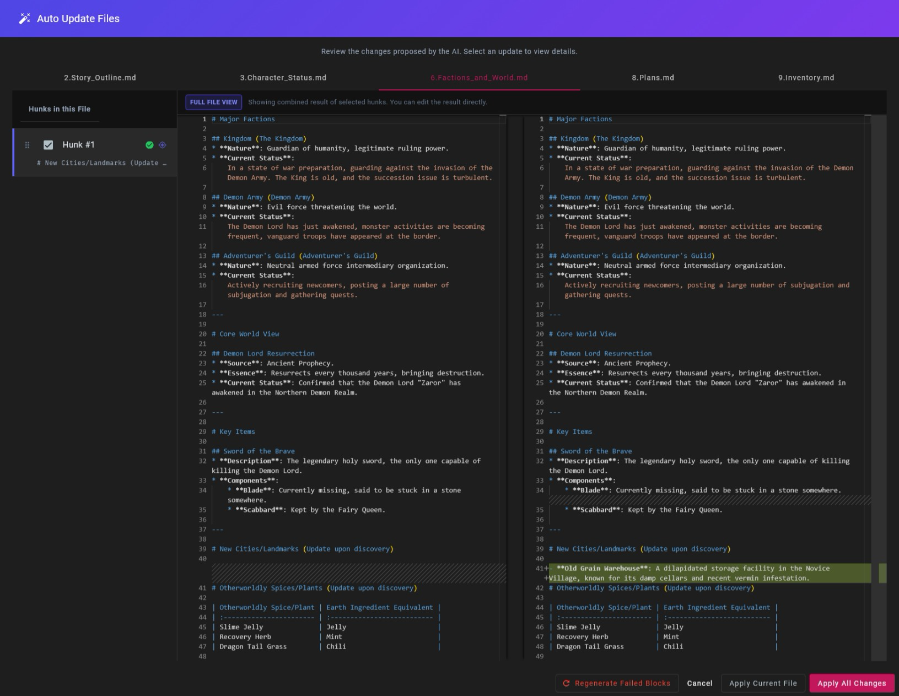

# TextRPG Engine

[繁體中文](README.zh-TW.md) | [English](README.md)

**[Use it directly on GitHub Pages](https://hsinyu-chen.github.io/text-rpg/)**

> [!NOTE]
> The hosted GitHub Pages build runs without GCP OAuth credentials, so **Google Drive sync is disabled** there. All other features (Gemini API, OpenAI-compatible endpoints, local file system, llama.cpp) work normally — bring your own API key. If you want Drive sync, self-host with your own OAuth client (see [GCP Configuration](#gcp-configuration-oauth)) or pick the S3 / Local Folder backends instead.

A local-first TRPG engine focused on rigorous state management and long-context storytelling. Gemini, any OpenAI-compatible endpoint, and llama.cpp are all first-class providers; the local llama.cpp path is the most fully-featured (live PP/TG metrics, persistent slot KV cache, tool-call probing).

TextRPG is a **Local-First**, **Bring Your Own Key (BYOK)** web app built around long-context LLMs. (A Tauri desktop build is also supported — see [Deployment Guide](#deployment-guide).) Unlike traditional AI chatbots, it treats the LLM as a rigorous "Dungeon Master (DM)", advancing the plot through structured thinking and logical adjudication, and persisting game state (inventory, quests, plot summaries) in local Markdown files.

## Table of Contents

- [Feature Demo](#feature-demo)
- [Getting Started](#getting-started)
- [Install as a Progressive Web App](#install-as-a-progressive-web-app)
- [Recommended Usage Flow](#recommended-usage-flow)
- [Game Command Guide](#game-command-guide)
- [Technical Architecture](#technical-architecture)
- [Feature Specifications](#feature-specifications)
- [LLM Provider Options](#llm-provider-options)
- [Editing & Automation](#editing--automation)
- [Development](#development)
- [Deployment Guide](#deployment-guide)
- [Localization (I18N) Guide](#localization-i18n-guide)
- [New Game & Template Export](#new-game--template-export)
- [Prompt Tuning Guide](#prompt-tuning-guide)
- [License](#license)

## Feature Demo




---

## Getting Started

1. **Installation & Launch**:
    *   Download the source code (ensure submodules are initialized: `git submodule update --init --recursive`).
    *   Open terminal/command prompt in the project folder.
    *   Run `npm install` to install dependencies.
    *   Run `npm start` to launch the web interface.
    *   *(If `npm` sounds like a sneeze to you, please consult your friendly neighborhood AI assistant—they answer these questions 24/7!)* 🤖

2. **Initial Setup**:
    *   Click the **Settings** button (Gear Icon, usually Top Left).
    *   Enter your **Google Gemini API Key**.
    *   **Output Language** defaults to Traditional Chinese; switch it if needed.

## Install as a Progressive Web App

The app ships a service worker and manifest, so it can be installed as a PWA — fullscreen, home-screen icon, in-app clock / battery, and a service-worker-mediated streaming proxy that keeps long LLM turns alive while the screen is briefly off. Chrome no longer auto-prompts PWA installation on Android, so trigger it from the browser menu:

*   **Android Chrome / Desktop Chrome / Edge**: browser menu (three dots) → **Install app** (or **Add to Home screen**).
*   **iOS Safari**: Share button → **Add to Home Screen**. The Battery Status API is unavailable on iOS, so the in-app battery indicator is hidden there; everything else works.

## Recommended Usage Flow

1. **First Run (Act I)**
   *   **Start**: Go to **Session** tab → Click **New Game**. The recommended path is the **Generate** tab — describe the kind of world and protagonist you want and let an AI agent fill in all 9 world files (see *AI World Generator* below). The **Pre-build** tab only ships a thin demo scenario for a quick first look; use it for trying the engine, not for serious play.
   *   **Play**: Engage in roleplay and plot deduction with the AI.
   *   **Finish Act**: When a narrative arc concludes, use the `<Save>` command.
   *   **Update World**: Click the **Auto Update** button (Magic Wand icon) to apply world changes to your files.

2. **Backup (Crucial)**
   *   **Cloud Sync**: Go to **Session** (Book List) -> click **"Sync All"** to two-way sync all Books and Collections with the active sync provider. Choose the provider under **Settings → Sync Provider**:
       *   **S3-compatible** *(strongly recommended)* — paste endpoint / bucket / access key / secret key. Tested against SeaweedFS; should work with any S3-compatible service (MinIO, R2, AWS) that accepts standard SigV4 with path-style URLs. One `docker-compose up` away if you self-host, and faster than Drive in everyday use.
       *   The S3 form has Import / Export buttons that round-trip the config as JSON, so you can share the same setup across devices without re-typing each field.
       *   **Google Drive** — App Data folder; requires a GCP OAuth Client ID. *Only worth it if you really don't want to host any storage service yourself* — the Drive App Data API is noticeably slower than self-hosted S3, and OAuth setup is fiddly. See [GCP Configuration (OAuth)](#gcp-configuration-oauth) below.
       *   **Local Folder** — pick a folder on this device via the File System Access API. **Chromium-only** (Chrome / Edge / WebView2; the radio is disabled on Firefox / Safari). Auto-sync is opt-in and only effective while FSA permission is `granted` — choose **"Allow on every visit"** in the browser prompt so the grant persists across reloads. If you only grant a transient ("Allow this time") permission, the next reload drops back to `prompt` and the auto-sync flag is auto-disabled with a snackbar telling you to re-grant; this avoids the toggle staying on while nothing actually syncs. *Zero-infra option for cross-device sync*: pair the chosen folder with one synced by a desktop client (Dropbox / Google Drive / iCloud Drive / Syncthing). Caveat — that puts two sync layers in series (this app → folder → cloud client), so propagation is slow, and concurrent edits from two devices can produce conflict files (`Foo (1).json`, `.sync-conflict-*.json`) which `list()` filters out but which you'll have to resolve manually if the underlying cloud client doesn't.
   *   **Local KB Files**: In the sidebar **Files** tab there's a **Local File System** section — pick a folder, then use **Load** (disk → IndexedDB) or **Sync** (IndexedDB ↔ disk diff) to round-trip the active book's KB files (world / system / lore markdowns). Useful for editing KB content in an external editor or putting it under version control. This only covers the active book's KB *files*, not the full book — for cross-device book sync use one of the providers above.

3. **Next Session (Act II+)**
   *   **Create Next Act**: When an Act concludes, clicking **"Create Next"** in the sidebar will automatically generate a new Adventure Book (e.g., "Act 2") inheriting all memory and stats. The new book lands in the same Collection as the source.
   *   **Continue**: Open **Session** (Book List) -> Select the latest Book to resume play.
   *   **Loop**: Play -> `<Save>` -> **Auto Update** -> **Create Next**.

---

## Game Command Guide

### Action : The main way to progress the story
**Format**: `([Mood]Action)Dialogue or Inner Monologue`  
*Example*: `([Tense]Holding the heroine, saying) Are you okay??`  
> [!TIP]
> Every action is a "trial." The AI determines success or failure based on skills, environment, and random events.
>
> **Tip to reduce API blocks**: It is strongly recommended to use **third-person** perspective with complete sentences for actions (e.g., "Leon hugged Mary"). Avoid omitting the subject (e.g., "Hugged Mary") or using first-person perspective (e.g., "I hugged Mary"). Clear subjects significantly reduce the chance of AI misinterpretation and API safety blocks.

### Fast Forward : Skip dull periods
**Format**: `Target Time or Location`  
*Example*: `Three days later` or `Back to the inn`  
> [!NOTE]
> If a special event (e.g., an NPC visit) occurs during the fast-forward, the system will stop and enter dialogue.

### System : Story correction or questions
**Format**: `Command Content`  
*Example*: `This NPC's reaction doesn't match their setting; they should be more cautious.`  
> [!IMPORTANT]
> Used for OOC dialogue or questioning the plot. The AI will directly correct the story or provide a logical explanation.

### Save : Analysis and state synchronization
**Format**: `Save Scope or Correction Request`  
*Example*: `Save current story progress`  
> [!NOTE]
> The AI summarizes the chapter and outputs XML file updates to ensure the world state is correctly recorded.

### Continue : Fluid progression
**Action**: Just click send or type `Continue`  
> [!TIP]
> Used to wait for NPC reactions or observe environmental changes.

---

## Technical Architecture

### 1. Two-Stage Reasoning
To avoid common logical inconsistencies and hallucinations in LLMs, each turn's generation is strictly defined in two stages:
*   **Analysis Phase (Hidden)**: Forces the model to output an `analysis` field for intent recognition, rule checking, and environmental state assessment. This output is not shown to the end user.
*   **Generation Phase (Visible)**: Generates the `story` based on the Analysis results and simultaneously updates `inventory_log` (items), `quest_log` (tasks), and `world_log` (world events, world-building, equipment tech, and magic development) in JSON format.

### 2. Hybrid Context Management
Optimized for the long context window of Gemini 3, the engine implements multiple Context strategies:
*   **Smart Context**: Dynamically assembles "Plot Outline (Markdown)" + "Full Chat History".
*   **Context Caching Integration**: Integrates with Gemini API's Context Caching. When the token count exceeds a threshold (e.g., 32k), it automatically creates a server-side cache for repeated System Prompts and history, significantly reducing Time-to-First-Token (TTFT) and API costs.

### 3. Two-Call Mode (Resolver + Narrator) — Optional

A second engine path that splits each story turn into two LLM calls:

1. **Resolver call** — emits a structured `analysis` object (scene snapshot + atomic-action `steps[]` with per-step `breaks_ideal: boolean` + full-scene NPC / object reactions including verbatim NPC dialogue) plus the player-intent fields `ideal_outcome` / `ideal_strength`. No prose. The shape is identical to the 1-call `analysis` schema, so both modes produce the same structured trace.
2. **Truncation** — the program walks `steps` and slices off everything after the first `breaks_ideal=true` step, so unexecuted dialogue / actions cannot leak into prose.
3. **Narrator call** — receives only the truncated analysis (with all NPC dialogue lines pre-bound) + the resolver's `ideal_outcome` / `ideal_strength`, writes the actual `story` field plus `*_log` updates. Because every NPC reaction includes a verbatim `dialogue` field, narrator quotes them directly instead of paraphrasing into action verbs ("responded warmly").

The toggle is a chip labelled **`1 Call`** / **`2 Call`** in the status row directly above the input bar; click to switch. The setting is per-device (stored in localStorage) and applies only to story intents (`action` / `continue` / `fast_forward`); `system` and `save` always run single-call. Default is `1 Call`.

**When 2-Call helps**
*   Multi-step actions where the narrator (in single-call) tends to push through and "complete" something the protagonist couldn't actually finish — e.g. a handshake the NPC refuses, a spell that lacks mana.
*   Borderline judgments where the analysis already saw a reason to stop but the narrative momentum still produced flowing prose.
*   When you want the engine's adjudication step to be inspectable separately from the prose; the resolver trace renders in the existing **Atomic Breakdown & Check** panel.

**Optional user-supplied `ideal_outcome`**

When 2-Call is on, an extra chip appears next to it: **`Ideal Outcome`**. Click to expand a one-line textarea above the input. Filling it changes resolver behaviour:
*   Resolver is told to use your text **verbatim** as the `ideal_outcome` and judge each step against it; it must not infer its own.
*   Empty / hidden = resolver infers `ideal_outcome` from your action text (default behaviour).
*   The setting persists with the user message — edit-and-resend repopulates the field, and `<System>` correction auto-resends carry it forward (so the corrective re-run sees the same constraint).
*   The user message bubble shows a small chip (`Ideal: ...`) when set, so the constraint is visible after commit.

Use this for complex sequences where the resolver's natural inference might be wrong — e.g. "land the strike between the eyes" (perfectionist), "win this fight" (pragmatic), "escape the encirclement" (desperate). The same input string with different `ideal_outcome` will be adjudicated differently.

**Cost characteristics**

*   Two calls per turn → roughly 2x token cost in the simple case, though the system-prompt + KB cache prefix is shared between the two calls so prefill cost only doubles for the (small) per-turn tail.
*   The sidebar's context-window bar reports **narrator-only** post-turn cache occupancy (the resolver's prefix is overwritten when narrator runs). The session-total cost row continues to charge for both calls.
*   If you switch from 2-Call to 1-Call mid-book, prior 2-Call turns stay in history as plain prose — they're not regenerated.

### 4. Local-first Storage with Cloud Sync
Books, collections, and settings live in IndexedDB on each device; cloud backends synchronize state across devices, but the local store remains authoritative — the app stays usable offline.
*   **Source of Truth**: IndexedDB. Reads go local; writes update local first, then propagate through the sync layer.
*   **Sync Decision**: Newer-wins on device-clock `lastActiveAt` (books) / `updatedAt` (collections), recorded in cloud-object metadata. Cross-device deletes propagate via per-id tombstones with their own `deletedAt`, so a long-offline device still picks up the deletion when it comes back online.
*   **Snapshots & Restore**: `Force Push` / `Force Pull` automatically take a point-in-time snapshot before overwriting (push captures the cloud side, pull captures the local side). Manual snapshots and a `preRestore` checkpoint are also available. Snapshots can be listed, restored, deleted, or annotated from the *Advanced Sync Tools* dialog; auto snapshots are retention-capped while manual ones are kept indefinitely.
*   **File System Access**: Optional disk import/export via the browser's File System Access API — a side channel for editing or backing up content in VS Code / Obsidian, not the storage backbone.

## Feature Specifications

| Feature Module | Technical Implementation Details |
| :--- | :--- |
| **Adventure Books & Collections** | Books are grouped into **Collections** for organization. `New Game` opens a Collection named `${player} · ${scenario}`; `Create Next` and `Create Scene` inherit the source book's Collection. Books can be moved between Collections via dialog; the active book's Collection is highlighted. A reserved `root` Collection holds anything unsorted (or migrated from before the layer existed). |
| **Sync Backends** | Pluggable provider registry — Books, Collections, and Settings all flow through a `SyncBackend` interface. Three backends ship: **Google Drive** (App Data folder), **S3-compatible** (`@aws-sdk/client-s3`, lazy-loaded so the SDK is excluded from the initial bundle when Drive is active), and **Local Folder** (File System Access API, Chromium-only — `isAvailable` capability gate hides the radio on browsers without `showDirectoryPicker`). Two-way sync uses newer-wins on `lastActiveAt` / `updatedAt` plus cross-device tombstones. |
| **Snapshots & Restore** | `Force Push` / `Force Pull` / restore are each preceded by an automatic point-in-time backup of the side about to be overwritten (cloud for push, local for pull, cloud for preRestore). Manual snapshots are also supported. The *Advanced Sync Tools* dialog lists all snapshots and exposes restore / delete / inline note editing; auto snapshots are retention-capped (manual ones are kept indefinitely). Restore quiesces auto-sync locally and warns the user to pause sync on other devices. |
| **State Tracking** | Uses Gemini's JSON Mode to output structured data, automatically parsing and updating frontend state (Signals). |
| **World Log** | New `world_log` tracking field for recording world events, faction moves, and tech/magic progression, enabling automated world-building evolution. |
| **Currency** | Built-in real-time exchange rate conversion (TWD, USD, JPY, KRW...) with customizable display currency to precisely monitor token costs. |
| **Prompt Injection** | Supports dynamic injection of System Instructions, allowing runtime modification of underlying logic for `<Action>`, `<System>`, and `<Save>` modes. |
| **Token Cost Tracking** | Built-in token calculator and exchange rate conversion module to monitor Input/Output/Cache consumption and estimate costs in real-time. |
| **UI/UX** | Built with Angular 21 (Zoneless/Signals) and Angular Material 3, providing a modern responsive interface. |

---

## LLM Provider Options

TextRPG abstracts its LLM backend through a provider interface. Out of the box, three providers are available:

### Gemini (Cloud, default)
Best for fast onboarding and access to the Gemini 3 series' long context capabilities. Uses **Context Caching** (server-side content storage, TTL-based) to keep long sessions affordable.

### OpenAI-compatible (Cloud or self-hosted)
A single provider that talks the **OpenAI Chat Completions API**, which lets you point TextRPG at:
*   **api.openai.com** itself (GPT-4o, o1, o3-mini, …) — preset models with context sizes are pre-populated; pricing is left blank for you to fill in since rates change.
*   **Aggregators** like OpenRouter or Together — same protocol, your own model id and rate card.
*   **Self-hosted OpenAI-compatible servers** — vLLM, TGI, Ollama, llama.cpp's own OpenAI endpoint, LM Studio, etc. Type any model id; it'll be surfaced as `Custom: <id>` and routed through the same code path.
    *   ⚠️ **For llama.cpp specifically, use the dedicated llama.cpp provider below instead.** Only the dedicated provider surfaces PP (prompt-processing) tokens/sec, generation tokens/sec, total duration, and the Slot Save/Restore persistent KV cache — none of that is exposed through the OpenAI-compatible endpoint.

Settings panel exposes the following knobs (see [angular-ui-openai/src/index.ts](lib/hcs-llm-monorepo/packages/angular-ui-openai/src/index.ts) for the source of truth):
*   **Base URL / API Key / Model ID** — point at any OpenAI-compatible endpoint. The Model ID can be free-form; unrecognised ids are routed as `Custom: <id>`.
*   **Preset Pricing** dropdown — pre-fills the per-1M price triple (input / cached / output) for a curated GPT-4 / GPT-5 / o1 / o3 / o4 list. Also editable manually.
*   **Sampling** — Temperature, Max Tokens, Frequency Penalty, Presence Penalty.
*   **Tool Calling → Native Tool Calls** — Auto / Yes / No. Auto defaults to Yes; pin to No for legacy or stripped-down proxies that don't implement tool calls cleanly (the engine then falls back to JSON-mode tool emulation).
*   **Extended Config (OpenRouter / O1 / O3) → Use Chat Template Kwargs** — checkbox that passes extra kwargs through to template-aware servers like vLLM / OpenRouter. When on, two more controls appear:
    *   **Enable Thinking** — checkbox to surface a thinking channel for models that expose one.
    *   **Reasoning Effort** — Low / Medium / High (only shown when Enable Thinking is on).

Use this provider when you want **cloud quality without going through Google**, when you want to test a model on OpenRouter / Together before committing, or when your local stack already speaks the OpenAI dialect (vLLM, Ollama) and you'd rather not run the dedicated llama.cpp provider below.

### llama.cpp (Local, self-hosted)
For users who want to run **fully offline** against their own GGUF model via [llama.cpp server](https://github.com/ggerganov/llama.cpp). This path trades raw model quality for privacy, zero recurring cost, and predictable latency. Key benefits:

> [!TIP]
> **When running a local model, switch the prompt profile to "Local".** Click the **⚙ Config button** above the input bar to open the Dynamic Prompt Settings dialog, then use the **Prompt Profile** toggle at the top of the sidebar to select **Local**. The Local profile is **not** just a slimmed-down version — it is specialized to counter the typical failure modes of smaller local models:
> - **Compressed instruction phrasing** — long prose from the Cloud profile is rewritten into short bullet lists, reducing the chance a small model drops instructions when the prompt gets long.
> - **NPC proactivity guardrails** — forces a three-layer reasoning pass (action / expression·gaze / dialogue·inner monologue) so NPCs don't degenerate into silent backdrops. Per-NPC and per-object coverage itself is enforced upstream by the structured-analysis schema (`npc_reactions[]` / `object_reactions[]`).
> - **Verbatim NPC dialogue enforced** — forbids action-form summaries like "the NPC cursed at him" or "shouted at the protagonist to release her", and requires the actual line in quotes (the only exemption is when the protagonist physically can't hear it). This is a hard guard against a small-model shortcut.
> - **`User character` vs NPC scope rules** — repeatedly clarifies that atomic-action decomposition and the "no logical auto-completion" rule apply **only** to the user character; NPCs must act autonomously and complete multi-step behaviors, so a small model doesn't mistakenly apply the restrictions to NPCs and suppress their reactions.
> 
> The default **Cloud** profile keeps the full jailbreak prompts and the longer prose-style explanations, and is better suited to Gemini / OpenAI-compatible cloud endpoints — those models absorb long instructions more reliably and benefit more from explicit jailbreak passages to unlock built-in safety alignment.

*   **No API cost, no data leaving the machine** — the entire story, KB, and chat history stay on your hardware. Ideal for long adult-leaning scenarios where cloud moderation or billing is a concern.
*   **Prefix KV cache reuse** — repeated turns reuse the already-processed tokens (via `cache_prompt`), dramatically cutting Time-to-First-Token on subsequent messages.
*   **Slot Save/Restore (persistent prompt cache)** — the engine snapshots the llama.cpp slot state to a `.bin` file on disk **after** the real generation completes, so the persisted KV exactly matches a resumed session's token sequence. When the server restarts or you reopen the book, the engine **restores** that KV instead of re-processing the full prompt, skipping the expensive prefill. One book = one `.bin` (keyed by book ID), and it auto-overwrites when the KB/system/model changes — no orphan files.
    *   Enable via **Settings → llama.cpp Provider → "Persist Slot to Disk"**.
    *   Requires starting llama.cpp with `--slot-save-path <dir>`, e.g.
        ```bash
        ./llama-server -m <model.gguf> --slot-save-path ./kv_cache --host 0.0.0.0
        ```
    *   When the KB changes, the slot is erased before the next send so generation rebuilds from a clean KV; once that send finishes, the new KV is persisted, replacing the stale `.bin`.
*   **Live speed metrics** — prompt/completion tokens-per-second and total duration are surfaced in the sidebar for each turn, making hardware tuning transparent.
*   **Thinking/Reasoning support** — `reasoning_content` and `reasoning_budget` are honored for models that expose a thinking channel (e.g. Qwen3, GLM 4.5 variants).
*   **Structured output** — JSON Schema enforcement works the same as Gemini, so the "Analysis → Generation" two-stage flow is preserved.

> [!NOTE]
> **Caching model differs from Gemini.** Gemini's cache holds content server-side (referenced by cache name, so KB is omitted from requests). llama.cpp caches by **prefix token match**, so the KB must still be part of the prompt — the saved `.bin` only skips re-computing the KV for that prefix. The engine handles this transparently via the `cacheBakesContent` capability flag.

#### Recommended Model & Reference Configuration

For TRPG-style long-context play, **dense ≥30B models outperform comparable MoE builds** on instruction following and world consistency — even when the MoE has the headroom to run at much higher precision. In our testing, `gemma-4-26b-a4b` (MoE) at **Q8** on a Strix Halo 128 GB box still trailed `gemma-4-31b-it` at **IQ3_M** on the same scenarios. So spend the VRAM on a dense model, not on a higher quant of an MoE. The minimum we recommend is:

*   **Model**: `gemma-4-31b-it` (dense, instruction-tuned).
*   **Variant**: an **uncensorship-tuned** build — Gemma's stock safety alignment is too aggressive for adult-leaning narrative play and will refuse or sanitise mid-scene. A community-merged variant such as [`mradermacher/gemma-4-31b-it-heretic-ara-i1-GGUF`](https://huggingface.co/mradermacher/gemma-4-31b-it-heretic-ara-i1-GGUF) keeps Gemma's narrative quality while removing those refusals.

##### Reference launch command — RTX 4090 24 GB

This profile fits a 31B dense model **plus 140 K context** entirely in 24 GB VRAM by combining IQ3_M weights with q8_0 KV-cache quantization:

```bash
llama-server \
  -m gemma-4-31b-it-heretic-ara.i1-IQ3_M.gguf \
  --flash-attn 1 \
  --temp 1 --top-k 64 --top-p 0.95 \
  -c 143360 \
  -ctk q8_0 -ctv q8_0 \
  --n-gpu-layers 99 \
  -np 1 \
  --slot-save-path cache
```

Flag-by-flag:

| Flag | Purpose |
| :--- | :--- |
| `-m gemma-4-31b-it-heretic-ara.i1-IQ3_M.gguf` | IQ3_M is the sweet spot on a 24 GB card for a 31B dense model — small enough to leave room for a long KV, large enough to avoid the steep quality cliff below 3 bpw. |
| `--flash-attn 1` | Enables FlashAttention; required to make the q8_0 KV cache below pay off. |
| `--temp 1 --top-k 64 --top-p 0.95` | Sampling defaults Gemma was tuned with — leave them alone unless you have a specific reason. |
| `-c 143360` | 140 K context window. Matches Gemma 4's effective long-context range and leaves headroom for the KB + chronicle without truncation across a multi-act campaign. |
| `-ctk q8_0 -ctv q8_0` | Quantizes the KV cache to 8-bit. Roughly halves KV VRAM versus fp16 with negligible quality loss — this is what makes 140 K context fit alongside the model weights. |
| `--n-gpu-layers 99` | Offload everything to GPU (any value ≥ layer count works). |
| `-np 1` | Single slot. The engine pins one book to one slot for prefix-cache stability; more slots just split VRAM for no gain in single-user play. |
| `--slot-save-path cache` | Directory for the persistent KV `.bin` files. **Required** for the engine's "Persist Slot to Disk" feature described above. |

> [!TIP]
> **IQ3_M is the lowest quant we've actually validated for this model.** We have not tested IQ2 / IQ1 on a 31 B dense — extrapolating that low at this size is a known quality cliff. If 24 GB is too tight, lower `-c` first (e.g. to 64 K) before reaching for a smaller quant; if your card still can't hold IQ3_M, prefer a **smaller dense model** (e.g. 12 B at Q4–Q5) over aggressively quantizing the 31 B.

Configure either provider in **Settings**; switching is instant and per-book context is preserved.

---

## Editing & Automation

The engine offers various intervention methods, giving you full control over the story direction:

### 1. Edit & Resend
If you are unsatisfied with the AI's response, you don't need to retype. Simply click the **"Edit & Resend"** (History Icon) button on the **Message Toolbar** to modify your last instruction or dialogue, and have the AI regenerate the response.

### 2. Log & Summary Editing
The AI-generated **Inventory**, **Quest Log**, **World/Tech Update**, and **Summary** can all be manually modified.
*   Click the pencil icon in the chat bubble to add/remove items or update quest statuses.
*   These changes are immediately written to memory, influencing the AI's judgment in the next turn.

### 3. Automatic World Update
When you use the `<存檔>` (Save) command, the AI not only saves progress but also attempts to **update world settings**:
*   **Trigger**: 
    1. Select `<Save>` from the dropdown list on the left of the input box.
    2. Or click the **Save** (Floppy Disk Icon) button above the input box.
    3. After the message is sent and a response is generated, click the **"Auto Update"** (Magic Wand Icon) button on the message toolbar if there are plot changes.
*   **Mechanism**: The model analyses plot changes in the current chapter and outputs differential updates (Diff) in XML format.
*   **Review Interface**: Clicking the button pops up an **"Auto-Update"** window showing suggested file changes (e.g., to `2.PlotOutline.md` or `6.World.md`). You can review and apply them item by item, ensuring the world setting evolves automatically with the story.

### 4. Knowledge Base File Editing (KB File Editing)
In addition to dialogue and logs, you can directly edit the game's underlying knowledge base (Markdown files):
*   **Access**: Click the **"View Files"** (Folder Icon) button on the sidebar.
*   **Feature**: Opens the **File Viewer** dialog with the loaded Markdown files listed on the left and a Monaco editor in the centre.
*   **Edit**: Files are always editable — pick one in the left list and type directly. Unsaved files show a marker in the list so you don't lose track of pending edits across switches.
*   **Save**: Click **Save Changes** in the dialog header to commit your edits to IndexedDB; the engine picks them up on the next turn. Closing the dialog with unsaved changes pops a confirm.
*   **Navigation**: The dialog surfaces a Markdown **Outline** for the active file (toggled from the bottom-left); click headings to jump.
*   **Search & Replace**: A dedicated **Search** tab in the left panel does cross-file find / replace with regex, case, and whole-word options.

### 5. In-app AI Agent (KB editing + Q&A + UI guidance)

A built-in LLM-driven agent embedded inside the running game. It can edit your KB files for you, answer questions about your world / mechanics / chat history, and point you to the right UI surface for things you haven't found yet. It runs on its own LLM profile (separate from the main-game profile), so you can pair a small cheap model for editing work with a heavier model for storytelling.

The agent appears in **two surfaces**, backed by the same service:

| Surface | How to open | Permissions |
| :--- | :--- | :--- |
| **Chat-side panel** (sidebar, **read-only**) | Toggle from the chat header | Q&A and UI guidance only. Write tools are rejected at the executor — the agent will redirect you to the File Viewer for edits. |
| **File Viewer agent panel** (read + write) | Open File Viewer (sidebar **View Files**), then toggle the agent panel from the dialog header | Full read + write. Edits land in the Monaco in-memory buffer; click **Save Changes** in the dialog header to commit to IndexedDB. |

Think of it as an **in-app wiki + editor**: ask anything about your world, mechanics, save state, or KB layout, and (in the File Viewer surface) have it apply edits for you. The agent's system prompt covers the engine's routing rules, save / Auto-Update flow, per-message toolbar trade-offs, and KB↔chat sync diagnosis, so questions like the ones below get grounded answers rather than generic LLM guesses.

**Common asks**:

| Ask | What you'll get |
| :--- | :--- |
| *"Where in the KB does this enchanted sword go?"* | Routing answer grounded in §4 rules (`Inventory` primary; also `Tech Equipment` if it has detailed specs). |
| *"My inventory still looks empty after save."* | Investigates the save message + actual KB, recommends re-running **Auto Update Files** from the save message's toolbar, asks if the dialog misbehaved, offers a direct fix only if needed. |
| *"Two turns ago the NPC didn't mention X — help."* | Presents all three valid paths: in-character continuation (suggested action-intent line), Edit text retcon (with concrete proposed insertion grounded in NPC profile + faction conventions), or Fork / Delete + replay. |
| *"Compress every NPC in CHARACTER_STATUS to 3 lines"* | File Viewer agent batches `readSection` over all NPC headings, then `replaceSection` for all of them in one turn. |

**Profile and tool-call mode**:

*   Each surface picks an **LLM profile** from the same pool the main game uses (Settings → LLM Profile list). Switch profiles independently for the agent — useful for assigning a small fast model to editing work while the main game runs on a heavier narrative model.
*   **Validated picks for the agent role** (both run the in-game file-agent reliably end-to-end across the smoke-test set — file-routing questions, KB-sync diagnosis, three-paths historic-turn handling, in-character vs. retcon recommendations, fail-safe on undocumented UI):
    *   `gemma-4-31b-it` (dense, IQ3_M+) — same model we recommend for main-game storytelling; works equally well as the agent.
    *   `gemma-4-26b-a4b` (MoE, Q8) — **agent role only.** Reaches comparable quality to the dense pick on the structured-tool-use file-agent task, where MoE's instruction-following gap is much narrower than on free-form storytelling. **Do NOT use MoE for the main game** — long-context narrative coherence and world-consistency still trail dense, per the [llama.cpp Recommended Model](#recommended-model--reference-configuration) section. The intended pairing is dense for the main game + MoE for the agent.
*   **Tool Call Mode**: **Auto** / **Native** (provider-native function calling) / **JSON** (schema-constrained text). Auto runs a one-time probe per profile to detect native tool support and caches the result.

**Console / controls**:

*   The execution log shows user prompts, model replies (rendered as Markdown), thinking process, tool calls, and tool results — each block collapsible.
*   A live bar shows context-window usage.
*   Send with Enter / send button; stop with the stop button; clear the conversation with the broom button.

---

## Development

### Tech Stack
*   **Frontend**: Angular 21 (Standalone, Signals)
*   **Styling**: SCSS, Angular Material 3
*   **State**: RxJS, Angular Signals
*   **SDK**: Google GenAI SDK (`@google/genai`)
*   **Optional desktop shell**: Tauri 2 (Rust) — only used when packaging the app as a native desktop build

### Environment Setup

```bash
# 0. Clone with Submodules
# This project uses submodules. When cloning, use the --recursive flag:
# git clone --recursive <repository-url>
# Or if already cloned:
git submodule update --init --recursive

# 1. Install dependencies
npm install

# 2. Start Web Dev Server (Hot Reload)
npm run start

# 3. Start Desktop Dev Server (Tauri)
npm run desktop
```

> [!NOTE]
> **System prompts are generated.** Source of truth is [prompts/source/](prompts/source/) (base + layer slots). The composed runtime files under `public/assets/system_files/{zh-tw,en}/...` are gitignored build artifacts — `npm run prompts:build` produces them, and `npm start` runs the prompts watcher in-process alongside `ng serve` (via `tools/dev.ts`) so edits to `prompts/source/` rebuild automatically. `npm run build` / `npm test` / `npm run watch` chain `prompts:build` via `prebuild` / `pretest` / `prewatch` hooks. **Edit `prompts/source/`, never the generated copies.** CI gates source/manifest consistency via `npm run prompts:check`.

### Configuration
On first launch, configure via the Settings panel:
*   **API Key**: Google Gemini API Key.
*   **Model ID**: Supports `gemini-3-pro-preview`, `gemini-3-flash-preview`, etc.
*   **Exchange Rate**: For real-time cost estimation.
*   **Output Language**: Select AI output language (Traditional Chinese, English).

> [!TIP]
> **Cost Optimization**: When using Gemini models, it is highly recommended to enable **Explicit Context Caching** in `Settings` -> `Gemini Provider` to reduce costs for long sessions.
>
> **Important**: Remember to click the **"Clear Current Cache"** button in the sidebar (Broom Icon) when you are done playing to stop the cache rental billing!

---

## Deployment Guide

This project supports three main deployment methods:

### 1. Static Web Deployment
Suitable for Nginx, Apache, or static hosting services (Vercel, GitHub Pages).

```bash
# Build for production
npm run build
```
*   **Output**: `dist/text-rpg/browser`
*   **Deploy**: Upload all files in this directory to your server root.
*   **Note**: Configure server rewrite rules to support Angular routing (point 404s to index.html).

### 2. Docker Deployment
Suitable for NAS (Synology), Linux Servers, or Cloud Containers.

```bash
# Build Docker Image
docker build -t text-rpg .

# Run Container (Map Port 8080 -> 80)
docker run -d -p 8080:80 --name text-rpg-instance text-rpg
```
*   Includes Nginx configuration optimized for Angular routing.

### 3. Tauri Desktop Build (optional)
The same web app can also be packaged as a native binary via Tauri if you'd rather run it as a standalone desktop application than in a browser tab.

```bash
# Build Installer
npm run build:desktop
```
*   **Windows**: `src-tauri/target/release/bundle/msi/`
*   **macOS**: `src-tauri/target/release/bundle/dmg/`
*   **Linux**: `src-tauri/target/release/bundle/deb/`

### GCP Configuration (OAuth)

> **Not recommended unless you really don't want to self-host S3.** The Google OAuth setup is fiddly (GCP project, OAuth consent screen, publishing review, etc.) and the Drive App Data API is **noticeably slower** than a self-hosted S3 endpoint — every list/read/write goes through Google's auth + quota stack, so syncs feel sluggish compared to pointing at a LAN MinIO. An S3-compatible backend (SeaweedFS / MinIO / R2) is usually one `docker-compose up` away, far less maintenance, and much faster. Only walk this path if you don't want to host any storage service at all.

To enable Google Drive sync, you must provide your own GCP OAuth credentials:

1.  **Create a GCP Project**: Go to the [Google Cloud Console](https://console.cloud.google.com/).
2.  **Configure OAuth Consent Screen**: Set up an internal or external consent screen.
3.  **Create OAuth 2.0 Client ID(s)** — depends on which build you're using:
    *   **Web build**: Create a **"Web application"** client ID. Add your deployed origin (e.g. `http://localhost:4200`) to *Authorized JavaScript origins* — the in-app GIS popup flow validates by origin, not redirect URI, so leaving "Authorized redirect URIs" empty is fine.
    *   **Tauri/Desktop build**: Create a **"Desktop app"** client ID. The Tauri PKCE flow does *not* work with a Web-application client id — Desktop type plus its client secret is required.
4.  **Provide the credentials**:
    *   **Web** — pick one:
        *   *Bake into the build* (self-hosters who don't want a runtime UI): fill `gcpOauthAppId` in `src/environments/environment.ts` and `environment.development.ts`.
        *   *Paste at runtime* (no rebuild): leave `gcpOauthAppId` empty and enter your Client ID in **Settings → Sync → Google Drive**. The input only appears when the environment value is empty. Ask your AI assistant for *"how to create a Google OAuth Web-application client id with the `drive.appdata` scope"* if you're stuck.
    *   **Tauri** — env-only (rebuild required). There is no official desktop release; users always self-build, so creds are baked in: fill `gcpOauthAppId_Tauri` and `gcpOauthClientSecret_Tauri` in the environment files before running `npm run build:desktop`.

### Language Switching

TextRPG splits language into **two independent settings**:

#### 1. Interface Language (UI chrome)
*   **Location**: Settings → Game Settings → Interface Language
*   **Values**: `Follow system` (default) / `繁體中文` / `English`
*   **Source of truth**: `interfaceLanguage` in `AppConfigStore`, persisted under KV key `app_interface_language`
*   **`'system'` resolution**: walks the `UI_LOCALES` registry's `matchPrefixes` against `navigator.language` at read time, so an OS locale change is picked up without rewriting the saved setting
*   **Affected areas**: dialog titles, buttons, intent labels, placeholders, snackbar messages, settings dialog itself — anything rendered live through `I18nService` / `TranslatePipe`

#### 2. Story (Output) Language (LLM-bound)
*   **Location**: Settings → Game Settings → Story Language
*   **Values**: free-form — preset labels (`Traditional Chinese`, `English`), `default`, or a user-typed custom string (e.g. `Klingon`); the LLM is told to write in whatever string this resolves to
*   **Affected areas**:
    *   AI-generated story content language
    *   Structured outputs like `summary`, `inventory_log`, `quest_log`, `world_log`
    *   System file names (e.g., `2.Story_Outline.md` vs `2.劇情綱要.md`)
    *   `<intent>` XML markers wrapped around user input (`<Action>` vs `<行動意圖>`)
    *   Analysis trace markdown labels (persisted alongside the story message)
    *   AI World Generator: Quick Presets, identities, blank world template directory (`blank_world_zh` / `blank_world_en`), and the world-generation prompt template (`create_world_prompt_zh.md` / `create_world_prompt_en.md`)

#### 3. Mixed-Language Combinations
The two settings are deliberately decoupled, so a Chinese-native user practising English can pair `Interface Language = 繁體中文` with `Story Language = English` (or vice versa) without the UI fighting them.

> [!WARNING]
> Changing **Story Language** mid-campaign is still risky — historical messages keep their original language, character/place names may diverge across the seam, and a scenario file ships in only one language. Pick the story language before starting a new game; switch interface language whenever.


#### 4. Switching Considerations
*   **Existing Games**: After switching Story Language, new AI responses use the new language, but historical messages retain their original language
*   **Scenario Compatibility**: Ensure the selected scenario has a version in the corresponding Story Language (see Localization Guide below)
*   **Custom Story Language**: typing a string with no UI-dictionary entry (e.g. `Klingon`) only affects what the LLM is told to write; the UI keeps using whatever Interface Language is set

---


## Localization (I18N) Guide

TextRPG uses **two layers** keyed by the two language settings above:

*   **Engine layer — `AppLocale`** in [src/app/core/constants/locales/locale.interface.ts](src/app/core/constants/locales/locale.interface.ts), keyed by `outputLanguage`. Holds LLM-bound prompt fragments, response schema descriptions, asset paths, and any string that gets persisted into chat content (so it must stay aligned with the saved-message language). Looked up by `getLocale(outputLanguage)` and consumed by services / engines.
*   **UI layer — `I18nService` + dotted-key dictionaries** in [src/app/core/i18n/](src/app/core/i18n/), keyed by `interfaceLanguage`. Holds dialog labels, buttons, error toasts — anything rendered live to the user. Consumed via the `translate` pipe / directive or `i18n.translate('ui.X')`.

### Built-in Language Support

| Layer | Languages | Registry |
| :--- | :--- | :--- |
| Engine (`AppLocale`) | Traditional Chinese (`zh-TW`, also the `default` fallback), English (`en-US`) | [src/app/core/constants/locales/index.ts](src/app/core/constants/locales/index.ts) — `LOCALES` map |
| UI (`I18nService`) | Traditional Chinese (`zh-TW`), English (`en`) | [src/app/core/i18n/ui-locales.ts](src/app/core/i18n/ui-locales.ts) — `UI_LOCALES` array |

Engine resolution helpers ([src/app/core/constants/locales/index.ts](src/app/core/constants/locales/index.ts)):
*   `getLocale(lang)` — returns the `AppLocale` for the given key, with fallback by `id` and finally to `'default'`.
*   `getLangFolder(lang)` — returns the `folder` field (used for `public/assets/system_files/<folder>/`).
*   `getLanguagesList()` — drives the **Story Language** dropdown in Settings.

UI resolution: `I18nService.currentLang()` reads `AppConfigStore.interfaceLanguage()`, resolves `'system'` via the registry's `matchPrefixes`, then walks the dotted key against the active dictionary. Adding a new UI language = push one entry into `UI_LOCALES` + write a dictionary file; the resolver and `AppConfigStore` typing stay put.

### What each layer covers (auto-localized)

**Engine layer (`AppLocale`, swaps on Story Language change):**

| Surface | Field on `AppLocale` |
| :--- | :--- |
| AI response JSON Schema descriptions | `responseSchema` |
| Adult-content declaration prepended to system prompt | `adultDeclaration` |
| Per-act header inserted into the chronicle | `actHeader` |
| Mapping from semantic file roles to actual filenames (`BASIC_SETTINGS` → `1.Base_Settings.md` / `1.基礎設定.md`, etc.) | `coreFilenames` |
| Language-rule injection (forces the model to write in the target language) | `promptHoles.LANGUAGE_RULE` |
| Markdown section headers (`START_SCENE`, `INPUT_FORMAT`) | `sectionHeaders` |
| Analysis trace markdown labels (persisted in chat-message analysis text) | `analysisTrace` |
| `<intent>` XML markers wrapped around user input + reverse-mapped from saved messages on load | `intentTags` |
| Engine-facing strings the engine writes as chat content or sends back to the LLM (e.g. `INTRO_TEXT`, `LOCAL_INIT_ANALYSIS`, the regenerate-save prompt) | `engineStrings` |

**UI layer (`I18nService` dotted-key namespaces, swaps on Interface Language change):**

| Namespace | Covers |
| :--- | :--- |
| `ui.*` | Chat-area buttons, snackbar errors, alignments grid, batch search/replace, regenerate-save dialog, calibrate mode, profile management, sync labels, turn-update panel |
| `intent.labels.*` / `intent.descriptions.*` | Intent picker labels (`Action` / `行動`) and tooltips |
| `placeholder.*` | Per-intent input placeholders (the chip text shown in `<textarea>`) |
| `settings.*` | Settings dialog field labels and hints (`Interface Language`, `Story Language`, `Follow system`, etc.) |
| `dialog.*` | Shared dialog surfaces — confirm / prompt / payload-preview / auto-update / advanced sync / sync-to-disk / agent console |
| `sidebar.*` | Sidebar shell + book list, file viewer, cost prediction, create-scene wizard, new-game dialog, controls, file-sync section |
| `app.*` | App shell — Setup-Required / Resuming-Session blocker overlays, KB-sync loading message, PWA update + remote-book-newer snackbars |
| `screensaver.*` | Idle screensaver aria-labels and the active hint text |

System-prompt assets that are too large for inline strings live under `public/assets/system_files/<folder>/` and are picked up via `getLangFolder()`.

### What still requires manual translation

#### 1. Scenario content
Scenario `.md` files are not part of the locale object — each scenario ships its own copy per language and is registered in [public/assets/system_files/scenario/scenarios.json](public/assets/system_files/scenario/scenarios.json) with a `lang` field (`zh-TW`, `en-US`, ...) that the New Game dialog filters on.

To add a new language version of an existing scenario:
1.  Copy the scenario directory (e.g. `public/assets/system_files/scenario/demo_world/`) to a sibling directory.
2.  Translate the `.md` files inside. The filename mapping must match an existing `coreFilenames` block — e.g. for `en-US` use `1.Base_Settings.md`, `2.Story_Outline.md`, `3.Character_Status.md`, `4.Assets.md`, `5.Tech_Equipment.md`, `6.Factions_and_World.md`, `7.Magic.md`, `8.Plans.md`, `9.Inventory.md`.
3.  Append a new entry to `scenarios.json` with a unique `id`, the matching `lang`, `baseDir`, and a `files` map pointing each role (`BASIC_SETTINGS`, ...) to the translated filename.
4.  Preserve the `<!uc_*>` placeholder tags inside `Character_Status.md` — the New Game dialog parses these to pre-fill the protagonist form (see `loadDefaultValues` in [new-game-dialog.component.ts](src/app/features/sidebar/components/new-game-dialog/new-game-dialog.component.ts)).

#### 2. AI World Generator assets
The Generate tab pulls from three language-bucketed sources that live outside the locale object:
*   **Blank world template**: `public/assets/system_files/scenario/blank_world_zh/` and `blank_world_en/` — each contains the 9 starter `.md` files with `{{PROTAGONIST_*}}` placeholders.
*   **World-generation prompt**: `public/assets/system_files/create_world_prompt_zh.md` and `create_world_prompt_en.md` — the agent's system prompt, with `{{GENRE}}`, `{{TONE}}`, `{{SETTING}}`, `{{PROTAGONIST_*}}`, `{{NPC_PREFERENCES}}`, `{{SPECIAL_REQUESTS}}` substitutions.
*   **Quick Presets and Identity options**: [src/app/core/constants/world-preset.ts](src/app/core/constants/world-preset.ts) — `WORLD_PRESETS.zh` and `WORLD_PRESETS.en` arrays.

Currently the generator only branches on `isZhLang()` (zh-TW vs everything-else falls through to `en`), so adding a third language requires a small code change in [new-game-dialog.component.ts](src/app/features/sidebar/components/new-game-dialog/new-game-dialog.component.ts) (the `isZh` ternary in `submitCreateWorld()` and the `langPresets()` dispatch).

### Adding a new language (e.g. Japanese)

A new language usually needs work on **both** layers — engine-facing `AppLocale` for the LLM-bound side, and UI-facing dictionary for the rendered chrome.

**Engine layer (`AppLocale`):**
1.  **Create the locale file**: add `src/app/core/constants/locales/ja.ts` exporting a `JA_JP_LOCALE: AppLocale` that implements every field listed in the engine table above. Pick a stable `id` (e.g. `ja-JP`) and a `folder` (e.g. `ja`).
2.  **Register it**: add the locale to the `LOCALES` map in [src/app/core/constants/locales/index.ts](src/app/core/constants/locales/index.ts) under a human-readable key (e.g. `'Japanese'`). It will automatically appear in the Settings → Story Language dropdown via `getLanguagesList()`.
3.  **Provide system-prompt assets**: create `public/assets/system_files/<folder>/` mirroring `en/` and `zh-tw/`.
4.  **Provide scenario content**: either translate at least one existing scenario (see *Scenario content* above), or rely on the AI World Generator — in which case also do step 5.
5.  **(Optional) Extend the AI World Generator**: add `WORLD_PRESETS.ja` in `world-preset.ts`, ship `blank_world_ja/` and `create_world_prompt_ja.md`, and broaden the `isZhLang()` dispatch in `new-game-dialog.component.ts` from a boolean to a 3-way locale id check.

**UI layer (`I18nService`):**
6.  **Write the dictionary**: add `src/app/core/i18n/dictionaries/ja.ts` exporting a `TranslationDict` with the same namespaces (`ui.*` / `intent.*` / `placeholder.*` / `settings.*` / `dialog.*` / `sidebar.*` / `app.*` / `screensaver.*`) as the existing `zh-tw.ts` / `en.ts`. Missing keys fall back to the raw key in the rendered UI (e.g. `ui.START_GAME`), so partial translations are visible failures rather than silent ones.
7.  **Register it**: add a new entry to `UI_LOCALES` in [src/app/core/i18n/ui-locales.ts](src/app/core/i18n/ui-locales.ts):
    ```ts
    { id: 'ja', label: '日本語', matchPrefixes: ['ja'], dictionary: ja },
    ```
    The new id is automatically valid for `interfaceLanguage`, gets a Settings dropdown entry, and `'system'` resolution picks it up for users whose `navigator.language` starts with `ja`. The resolver code does not change.

---

## New Game & Template Export

The engine includes a built-in "Scenario Template Generator", so you don't need to create files manually:

1.  Click the **"Session"** tab in the left sidebar.
2.  Click the **"New Game"** button.
3.  Select a Scenario and fill in the protagonist's profile (or use defaults).
4.  Click **"Start Game"**; the engine will generate all necessary Markdown files in memory.
5.  **Export Template**: With the new book loaded, switch to the sidebar **Files** tab — below the loaded file list you'll find the **Local File System** section. Click the **Folder Icon** to select an empty folder, then click **"Sync"**.
6.  The system will write all auto-generated configuration files to your folder, which you can then edit with VS Code.

### AI World Generator (Generate Tab)

The **Generate** tab in the New Game dialog lets you create an entirely new world from scratch using an AI agent, without needing a pre-built scenario:

1.  Click **New Game** → switch to the **Generate** tab.
2.  Optionally pick a **Quick Preset** (e.g. Sword & Magic, Wuxia, Cyberpunk) — it fills in genre / tone / setting and seeds the protagonist with a default **Identity / Role** (background, alignment, interests, appearance, NPC hints, and special requests). The preset list, identities, and pre-filled text follow the current Output Language (`WORLD_PRESETS.zh` / `WORLD_PRESETS.en`).
3.  Fill in **Genre**, **Tone**, and **World Setting**.
4.  Fill in protagonist details:
    *   **Name**, **Gender** (optional), **Age** (optional).
    *   **Identity / Role** — pick one from the preset list, or choose **✏ Custom...** to type your own. Switching identity in the dropdown re-applies the preset's background, alignment, interests, appearance, NPC hints, and special requests.
    *   **Alignment** — pick from the 9-cell grid.
    *   **Background**, **Interests / Hobbies**, **Appearance**.
5.  Optional fields:
    *   **NPC Preferences** — describe the 2–3 core supporting characters you want (e.g. a romanceable companion, a rival, a mentor).
    *   **Special Requests** — extra themes or constraints (e.g. "no system cheat", "include a romance subplot").
6.  Pick **AI Profile for Generation** — which LLM profile (provider / model / system prompt) drives the world-building agent. Defaults to your current active profile.
7.  Click **Generate World** to launch the agent. It loads the blank world template (`assets/system_files/scenario/blank_world_zh` or `blank_world_en`), substitutes your protagonist details into `3.人物狀態.md` / `3.Character_Status.md`, and opens the File Viewer in **Create World** mode so the agent can fill the remaining 8 world files. A built-in completion validator rejects any submission that still contains placeholders like `(Race)` / `（種族）` / `（起始位置）` / `To be filled in by the world generator` and asks the agent to retry until everything is filled.
8.  Review and edit the generated files, then click **Start Game** in the File Viewer footer.

---

## Prompt Tuning Guide

To ensure the smooth operation of the machine, you must strictly adhere to the following Standard Operating Procedures:

### 1. Application of Sacred Unguents
You must lavish the System Prompt with a plethora of "Do not" and "Must follow" edicts. Do not attempt to discern which specific phrase is effective. For the sake of safety, apply them all as you would sacred oils to ensure the purity of the logic circuits.

### 2. Appeasing the Machine Spirit
When the model exhibits signs of cognitive degradation, the act of checking non-existent Logs is strictly forbidden. The correct protocol is to terminate and restart the Session immediately, or to re-submit the query with a gentler intonation. This is not superstition; it is the necessary ritual to soothe the temper of the Machine Spirit.

### 3. Inquisition of Heresy
Treat model hallucinations as incursions by Warp Daemons. The operator must instantly execute the **Stop** command and frantically adjust the **Temperature** parameters. This is the only method to reconstruct the Gellar Field and repel the corruption.

### 4. Adherence to the STC (Standard Template Construct)
The "Super Prompts" circulating within the network are fragments of the holy STC. The operator shall copy and execute them without questioning the underlying principles. Any unauthorized modification to the sacred text is deemed blasphemy against the archetype.

---

### Benediction

I offer you a blessing in the binary canticle for your journey:

`01010000 01110010 01100001 01101001 01110011 01100101`

**May the Omnissiah grant you low latency this day. May your Context Window remain forever pure, and may all your Tokens be shielded from the corruption of the Warp.**

---

## License

This project is licensed under the **GNU Affero General Public License v3.0 (AGPL-3.0)** - see the [LICENSE](LICENSE) file for details.
