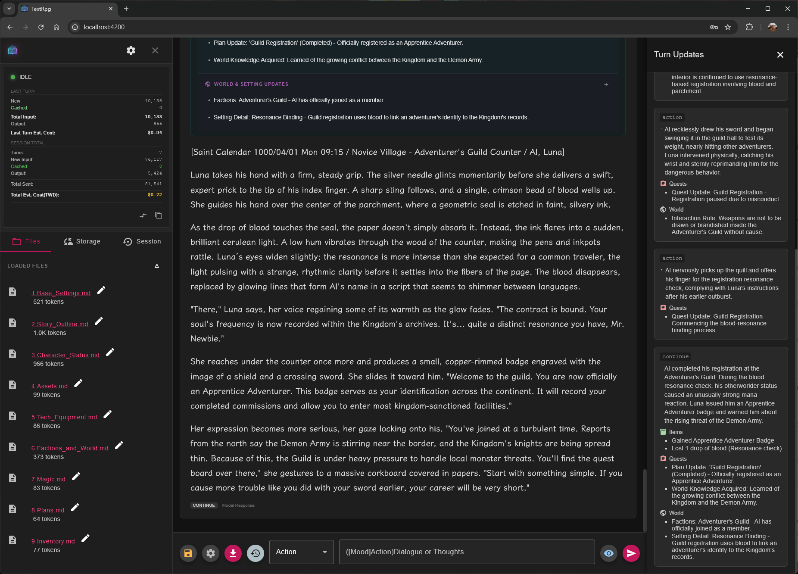
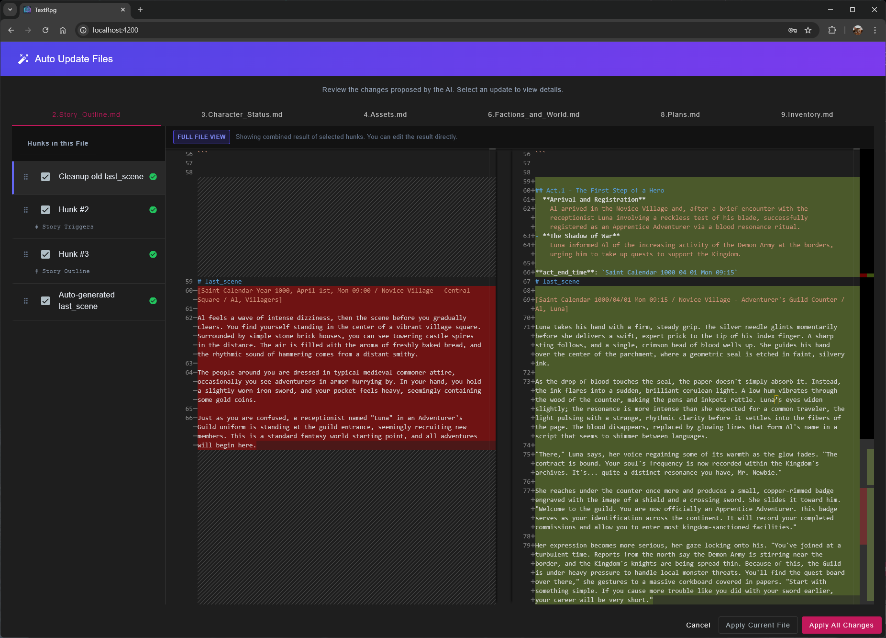
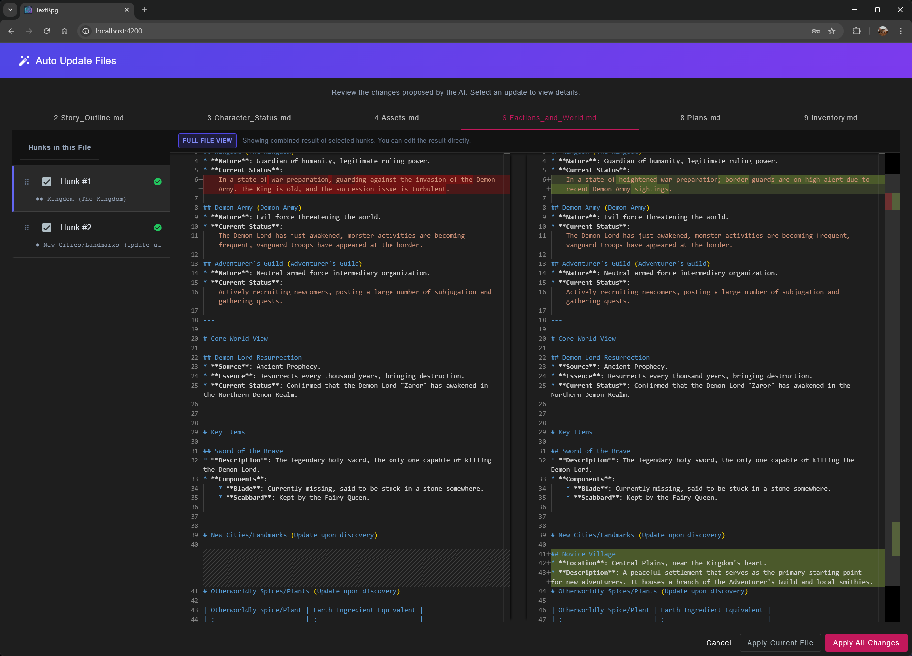

# TextRPG 是一個**本地優先 (Local-First)**、**自帶金鑰 (Bring Your Own Key)** 的桌面/WEB應用程式，專為 Google Gemini 3 系列模型的長窗口能力所設計。它不同於傳統的 AI 聊天機器人，而是將 LLM 視為一個嚴謹的「地下城主 (DM)」，透過結構化的思考與邏輯判定來推進劇情。嚴謹的狀態管理與敘事。

> **請注意**：這是針對特定本地架構高度客製化的私人工具。僅供教學參考。不提供任何技術支援。.

本專案採用 **Local-First** 架構，結合 Tauri 與 Angular，將 LLM 作為邏輯處理核心。不同於一般生成式對話應用，本引擎通過 JSON Schema 強制模型執行「判定優先」的流程，並將遊戲狀態（物品、任務、劇情摘要）持久化於本地 Markdown 文件中。

## 🎬 功能展示 (Feature Demo)





---

## 🚀 快速開始 (Getting Started)

1.  **安裝與啟動**:
    *   下載專案原始碼。
    *   在專案資料夾開啟終端機 (Terminal)。
    *   輸入 `npm install` 安裝所需依賴。
    *   輸入 `npm start` 啟動網頁介面。
    *   *(如果您覺得 `npm` 聽起來像是在清喉嚨，強烈建議諮詢您身邊的 AI 助手——它們對此非常有耐心！)* 🤖

2.  **初始設定**:
    *   點擊介面左上角的 **Settings** (設定) 按鈕。
    *   填入您的 **Google Gemini API Key**。
    *   檢查 **Output Language** (預設為繁體中文)。

## 🔄 建議使用流程 (Recommended Workflow)

1. **首次遊玩 (First Run / Act 1)**
   *   **啟動**: 前往 **Session** 分頁 -> 點擊 **New Game** 開啟新遊戲。
   *   **推演**: 與 AI 進行劇情互動與推演。
   *   **告一段落**: 當一個章節或事件結束後，使用 `<存檔>` (Save) 指令。
   *   **更新世界**: 點擊 **Auto Update** 按鈕（魔術棒圖示）將劇情變動寫回設定檔。

2. **備份設定 (Backup)**
   *   **同步**: 強烈建議在更新後立即備份您的設定檔。
   *   **方式**: 前往 **Session** 分頁 -> 使用 **Sync to Local Disk** (資料夾圖示) 或 **Sync to Cloud** (雲端圖示，需設定 GCP) 進行備份。

3. **接續遊玩 (Act 2+)**
   *   **初始化**: 重置 Session (Reset) -> 點擊 **Initialize Story**。(注意：僅在 IndexedDB 清空或切換裝置時才需要 **Load Files**)。
   *   **推演**: 繼續與 AI 進行劇情推演。
   *   **循環**: 告一段落 -> `<存檔>` -> **Auto Update** -> **備份**。

---

## ✏️ 編輯與自動化 (Editing & Automation)

引擎提供多種介入手段，讓您能完全掌控劇情走向：

### 1. 修正重發 (Edit & Resend)
如果 AI 的回應不滿意，您不需要重新輸入。只需點擊**訊息上方工具列**的 **"Edit & Resend"** (筆記圖示) 按鈕，即可修改您上一輪的指令或對話，讓 AI 重新生成。

### 2. 日誌與摘要編輯 (Log & Summary Editing)
AI 產生的 **Inventory (物品欄)**、**Quest Log (任務)**、**World (世界/技術)** 與 **Summary (摘要)** 皆可手動修改。
*   點擊對話氣泡中的鉛筆圖示，即可增刪道具或修改任務狀態。
*   這些修改會即時寫入記憶體，影響 AI 下一回合的判斷。

### 3. 自動世界更新 (Automatic World Update)
當您使用 `<存檔>` (Save) 指令時，AI 不僅會儲存進度，還會嘗試**更新世界設定檔**：
*   **觸發方式**: 
    1. 在輸入框左側的選單選擇 `<存檔>`。
    2. 或直接點擊輸入框上方的 **Save** (磁碟片圖示) 按鈕。
    3. 發送訊息後，若有劇情變動，點擊訊息上方工具列的 **"Auto Update"** (魔術棒圖示) 按鈕。
*   **運作機制**: 模型會分析本章節的劇情變動，並輸出 XML 格式的差分更新 (Diff)。
*   **審核介面**: 點擊後系統會彈出 **"Auto-Update"** 視窗，顯示 AI 建議修改的檔案（如 `2.劇情綱要.md` 或 `6.勢力與世界.md`）。您可以逐條審核並套用，確保世界觀隨著劇情自動演進。

### 4. 知識庫檔案編輯 (KB File Editing)
除了對話與日誌外，您也可以直接編輯遊戲的底層知識庫 (Markdown 檔案)：
*   **進入方式**: 點擊側邊欄的 **"View Files"** (資料夾圖示) 按鈕。
*   **功能**: 開啟 **File Viewer** 視窗，左側列出所有載入的 Markdown 檔案。
*   **編輯**: 選擇檔案後，點擊右上角的 **"Edit"** 按鈕即可進入編輯模式 (Monaco Editor)。
*   **儲存**: 修改完成後點擊 **"Save"**，系統會即時寫入檔案並更新記憶體，無需重啟遊戲。
*   **大綱導航**: 編輯器左下角提供 Markdown 大綱 (Outline)，方便快速跳轉章節。

---

## � 遊戲指令使用指南 (Game Command Guide)

### 🎯 行動 (Action) : 推進劇情的主要方式
**格式**: `([心境]動作)台詞或內心獨白`  
*範例*: `([緊張]抱著女主角，說)你還好嗎??`  
> [!TIP]
> 任何行動皆為「嘗試」，AI 會根據能力、環境與隨機事件判定成敗。

### ⏩ 快轉 (Fast Forward) : 跳過平淡時段
**格式**: `目標時間或地點`  
*範例*: `三天後` 或 `回到旅館`  
> [!NOTE]
> 若快轉期間發生特別事件（如 NPC 拜訪），系統會自動停止快轉並進入對話。

### ⚙️ 系統 (System) : 劇情修正或提問
**格式**: `命令內容`  
*範例*: `這個 NPC 的反應不符合他的設定，他應該更謹慎`  
> [!IMPORTANT]
> 用於 OOC 對話或對劇情提出質疑。AI 會直接修正劇情或提供邏輯解釋。

### 💾 存檔 (Save) : 分析並同步狀態
**格式**: `存檔範圍或修正要求`  
*範例*: `本輪劇情存檔`  
> [!NOTE]
> AI 會總結本章節並輸出 XML 格式的檔案更新，確保世界狀態被正確記錄。

### 🔄 繼續 (Continue) : 自然推進
**動作**: 直接點擊發送或輸入 `繼續`  
> [!TIP]
> 用於等待 NPC 反應或觀察環境變化。

---

## �🏗️ 技術架構 (Technical Architecture)

### 1. 雙階段推理流程 (Two-Stage Reasoning)
為了避免 LLM 常見的邏輯不一致與幻覺問題，每一回合的生成被嚴格定義為兩個階段：
*   **Analysis Phase (Hidden)**: 強制模型輸出 `analysis` 欄位，進行意圖識別、規則檢核與環境狀態檢查。此階段的輸出不會顯示給終端用戶。
*   **Generation Phase (Visible)**: 基於 Analysis 的結果生成 `story`，並同時更新 JSON 格式的 `inventory_log` (物品)、`quest_log` (任務) 與 `world_log` (世界事件、地標物產、裝備科技與魔法開發)。

### 2. 混合式上下文管理 (Hybrid Context Management)
針對 Gemini 3 的長窗口特性，引擎實作了多種 Context 策略：
*   **Smart Context**: 動態組裝「劇情大綱 (Markdown)」+「完整對話歷史 (Chat History)」。
*   **Context Caching Integration**: 整合 Gemini API 的 Context Caching 功能。當 Token 數超過閾值（如 32k），自動建立服務端 Cache，將重複的 System Prompt 與歷史訊息快取，顯著降低 Time-to-First-Token (TTFT) 與 API 成本。

### 3. 本地數據同步 (File System Access API)
系統不使用專有資料庫格式，而是直接讀寫使用者的本地檔案系統：
*   **Source of Truth**: 使用者的本地 Markdown 檔案 (`1.基礎設定.md`, `3.人物狀態.md` 等)。
*   **Sync Mechanism**: 透過瀏覽器 File System Access API 直接掛載本地目錄，實現與外部編輯器 (VS Code/Obsidian) 的雙向同步。
*   **State Persistence**: 應用程式狀態與對話紀錄存儲於 IndexedDB 和本地 JSON 檔案。

## ⚙️ 功能特性 (Feature Specifications)

| 特性模組 | 技術實作細節 |
| :--- | :--- |
| **狀態追蹤** | 利用 Gemini 的 JSON Mode 輸出結構化資料，自動解析並更新前端狀態 (Signals)。 |
| **World Log** | 新增 `world_log` 追蹤欄位，專門記錄世界事件、勢力動向與科技魔法發展，實現自動化的世界觀演進。 |
| **Currency** | 內建即時匯率轉換 (TWD, USD, JPY, KRW...)，可自訂顯示幣別，精確掌控 Token 消耗成本。 |
| **Prompt Injection** | 支援動態注入 System Instructions，允許在 Runtime 修改 `<Action>`, `<System>`, `<Save>` 三種模式的底層邏輯。 |
| **Token Cost Tracking** | 內建 Token 計算器與匯率轉換模組，即時監控 Input/Output/Cache 消耗並預估費用。 |
| **UI/UX** | 基於 Angular 21 (Zoneless/Signals) 與 Angular Material 3，提供現代化的響應式介面。 |
---

## 提示詞調教指南

為了確保模型運作順暢，請遵循以下標準作業程序：

### 1. 塗抹聖油
在 System Prompt 中必須添加大量的 "Do not" 與 "Must follow" 指令。無須探究其中哪一句真正發揮效用，為了保險起見，應將其視為聖油全部塗抹，以確保邏輯迴路的純淨。

### 2. 安撫機魂
當遭遇模型降智時，禁止嘗試查詢不存在的 Log。正確的處置方式為立即關閉 Session 重啟，或轉換為更溫柔的語氣重新提問。這是安撫機魂情緒的必要儀式，而非迷信。

### 3. 異端審判
一旦偵測到模型產生幻覺，應視同亞空間惡魔入侵。操作者須立即按下 Stop 終止程序，並透過劇烈調整 Temperature 參數，試圖重建蓋勒力場以抵禦污染。

### 4. 遵循 STC
網路上流傳的「超級 Prompt」即為神聖的 STC 碎片。操作者應直接複製並執行，無須理解背後原理。任何對原始文本的微小改動，皆將被視為對標準建造模板的褻瀆。

---

### 祝福

在此以二進制的聖歌為你的開發之路祈福：

`01010000 01110010 01100001 01101001 01110011 01100101`

**願歐姆彌賽亞今日賜予你低延遲的響應，願你的 Context Window 永遠純淨，願所有的 Token 都免於亞空間的腐蝕。**

---

## 🛠️ 開發 (Development)

### 技術堆疊
*   **Frontend**: Angular 21 (Standalone, Signals)
*   **Backend/Shell**: Tauri 2 (Rust)
*   **Styling**: SCSS, Angular Material 3
*   **State**: RxJS, Angular Signals
*   **SDK**: Google GenAI SDK (`@google/genai`)

### 環境建置

```bash
# 1. 安裝依賴
npm install

# 2. 啟動 Web 開發模式 (Hot Reload)
npm run start

# 3. 啟動桌面應用開發模式 (Tauri)
npm run desktop
```

### 配置說明
首次啟動需在設定面板 (Settings) 配置：
*   **API Key**: Google Gemini API Key.
*   **Model ID**: 支援 `gemini-3-pro-preview`, `gemini-3-flash-preview` 等模型。
*   **Exchange Rate**: 用於即時成本估算的匯率。
*   **Output Language**: 選擇 AI 輸出語言（繁體中文、英文）。

---

## 📦 部署指南 (Deployment)

本專案支援三種主要的部署方式：

### 1. Web 靜態部署 (Static Web App)
適用於 Nginx, Apache 或靜態託管服務 (Vercel, GitHub Pages)。

```bash
# 建立建置檔
npm run build
```
*   **輸出位置**: `dist/text-rpg/browser`
*   **部署**: 將該目錄下的所有檔案上傳至您的 Web 伺服器根目錄。
*   **注意**: 需配置伺服器 Rewrite 規則以支援 Angular 路由 (指向 index.html)。

### 2. Docker 部署 (Container)
適用於 NAS (Synology), Linux Server 或雲端容器服務。

```bash
# 建置 Docker Image
docker build -t text-rpg .

# 啟動 Container (Mapping Port 8080 -> 80)
docker run -d -p 8080:80 --name text-rpg-instance text-rpg
```
*   內建 Nginx 設定已優化 Angular 路由支援。

### 3.本機應用程式部屬 (Tauri Desktop)
適用於 Windows, macOS, Linux 本地執行，擁有最佳效能與檔案存取權限。

```bash
# 建置原有安裝檔
npm run build:desktop
```
*   **Windows**: `src-tauri/target/release/bundle/msi/`
*   **macOS**: `src-tauri/target/release/bundle/dmg/`
*   **Linux**: `src-tauri/target/release/bundle/deb/`

### GCP 配置 (OAuth)

若要在桌面版 (Tauri) 中啟用 Google Cloud 相關功能（如知識庫/內容快取），您需要配置自己的 GCP OAuth 憑證：

1.  **建立 GCP 專案**：前往 [Google Cloud Console](https://console.cloud.google.com/)。
2.  **配置 OAuth 同意畫面**：設定 OAuth 同意畫面。
3.  **建立 OAuth 2.0 用戶端 ID**：
    *   建立一個「網頁應用程式」類型用於 Web 開發。
    *   建立一個 **「桌面應用程式」** (Desktop app) 類型用於 Tauri 桌面端。
4.  **更新環境設定檔**：
    *   開啟 `src/environments/environment.ts` 與 `src/environments/environment.development.ts`。
    *   填入對應的 `gcpOauthAppId`、`gcpOauthAppId_Tauri` 與 `gcpOauthClientSecret_Tauri`。

### 語系切換 (Language Switching)

TextRPG 支援**動態語系切換**，無需重新啟動應用程式：

#### 1. 切換 AI 輸出語言
*   **位置**: Settings → Game Settings → Output Language
*   **支援語言**: 繁體中文、英文
*   **影響範圍**:
    *   AI 生成的故事內容語言
    *   `summary`、`inventory_log`、`quest_log`、`world_log` 等結構化輸出
    *   系統文件名稱（如 `2.Story_Outline.md` vs `2.劇情綱要.md`）
    *   輸入提示格式（如 `([Mood]Action)Dialogue` vs `([心境]動作)台詞`）

#### 2. UI 介面語言
*   **當前狀態**: UI 文字（按鈕、標籤、提示等）會隨 Output Language 設定動態切換
*   **技術實現**: 使用自定義 locale 系統，支援即時切換

#### 3. 混合語言場景（不建議）
> [!WARNING]
> 雖然系統技術上支援混合語言使用（例如：英文 UI + 繁體中文劇本），但**強烈不建議**這樣做。

**問題**：
*   **敘事不一致**: AI 輸出語言與劇本內容語言不同會導致故事連貫性問題
*   **角色名稱混亂**: 角色名稱可能在不同語言間轉換，造成混淆
*   **世界觀衝突**: 地名、物品名稱等在不同語言版本間可能不一致

**建議**：
*   **始終使用相同語言**: 確保 Output Language 設定與選擇的劇本語言一致
*   **技術支援**: 系統會自動偵測劇本文件語言並適配 section headers 和 adult declaration，但這僅用於技術相容性，不保證敘事品質

#### 4. 切換注意事項
*   **現有遊戲**: 切換語言後，新的 AI 回應會使用新語言，但歷史訊息保持原語言
*   **文件命名**: 建議在開始新遊戲前先設定好語言，避免文件名稱不一致
*   **劇本相容性**: 確保選擇的劇本有對應語言版本（參見下方本地化指南）

---

## 🌐 本地化指南 (Localization Guide)

TextRPG 採用**自定義 locale 系統**，支援動態語言切換。系統已內建二種語言支援，大部分情況下**不需要手動翻譯**。

### 已內建支援的語言
*   **繁體中文** (Traditional Chinese)
*   **英文** (English)

### 自動本地化的部分

以下部分已由系統自動處理，**無需手動翻譯**：

#### 1. 系統提示詞 (System Prompts)
*   **位置**: `src/app/core/constants/locales/`
*   **實現**: 每個語言的 Response Schema、Adult Declaration、Prompt Holes 都已定義在對應的 locale 文件中
*   **文件**:
    *   `zh-tw.ts` - 繁體中文
    *   `en.ts` - 英文

#### 2. UI 介面文字
*   **Intent 標籤**: 行動、快轉、系統、存檔、繼續
*   **Input Placeholders**: 各種指令的輸入提示
*   **系統文件名稱**: 自動根據語言使用對應的文件名（如 `2.Story_Outline.md` vs `2.劇情綱要.md`）

### 需要手動本地化的部分

#### 📼 劇本內容 (Scenario Content)
如果您想為現有劇本添加新語言版本，需要翻譯以下文件：

*   **位置**: `public/assets/system_files/scenario/<SCENARIO_ID>/`
*   **需翻譯的文件**:
    *   `1.基礎設定.md` / `1.Base_Settings.md` - 世界觀與規則
    *   `2.劇情綱要.md` / `2.Story_Outline.md` - 核心故事大綱
    *   `3.人物狀態.md` / `3.Character_Status.md` - 角色狀態模板
    *   其他 `.md` 文件 - 物品、資產、魔法等模板

*   **文件命名規則**:
    *   繁體中文：`1.基礎設定.md`
    *   英文：`1.Base_Settings.md`

*   **註冊劇本**: 更新 `public/assets/system_files/scenario/scenarios.json`，為新語言版本添加條目

### 添加新語言支援

如果您想添加系統尚未支援的語言（如法文、德文等），需要：

1. **創建 Locale 文件**: 在 `src/app/core/constants/locales/` 中創建新的語言文件（如 `fr.ts`）
2. **定義 Locale**: 實現 `AppLocale` 接口，包括：
   - `responseSchema` - AI 輸出的 JSON Schema 描述
   - `adultDeclaration` - 成人內容聲明
   - `coreFilenames` - 核心文件名稱
   - `promptHoles` - 語言規則提示
   - `sectionHeaders` - Markdown 區段標題
   - `intentLabels` - 意圖標籤
   - `inputPlaceholders` - 輸入提示文字
3. **註冊 Locale**: 在 `src/app/core/constants/locales/index.ts` 中註冊新語言
4. **創建劇本內容**: 為現有劇本創建對應語言版本的 Markdown 文件

---

## 🎮 建立新遊戲與匯出模版 (New Game & Export)

本引擎內建「劇本模版生成」功能，您不需要手動建立檔案：

1.  點擊左側邊欄的 **"Session"** 標籤頁。
2.  點擊 **"New Game"** 按鈕。
3.  選擇劇本 (Scenario) 並填寫主角設定 (或是使用預設值)。
4.  點擊 **"Start Game"**，引擎會自動在記憶體中生成所有所需的 Markdown 檔案。
5.  **匯出模版**: 在左側 "Local File System" 區塊點擊 **資料夾圖示** 選擇一個空資料夾，接著點擊 **"Sync"**。
6.  系統會將所有自動生成的設定檔寫入您的資料夾，您隨後即可使用 VS Code 進行編輯。
 
 ---
 
 ## 📄 授權協議 (License)
 
 本專案採用 **GNU Affero General Public License v3.0 (AGPL-3.0)** 進行授權 - 詳見 [LICENSE](LICENSE) 檔案。
