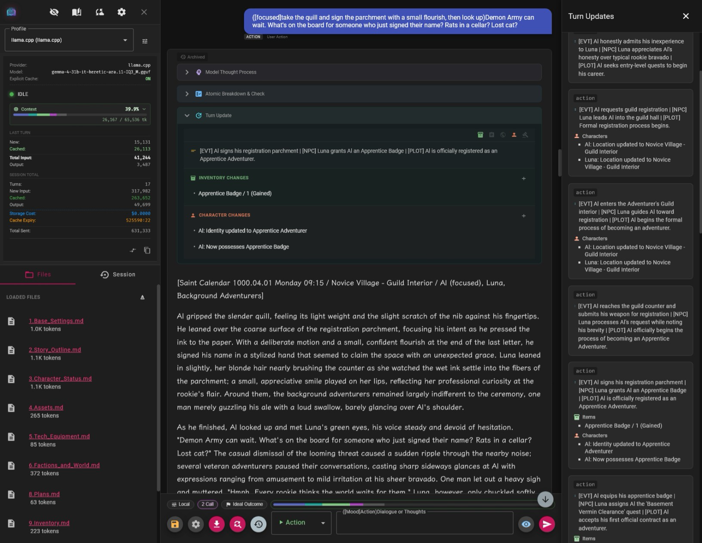
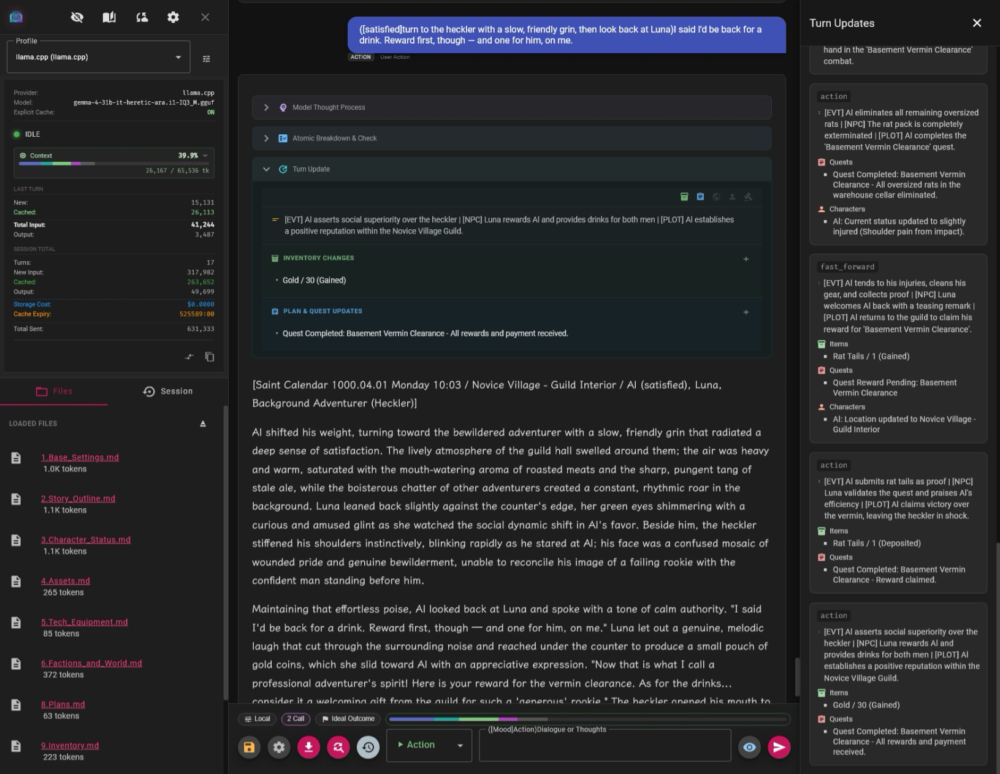
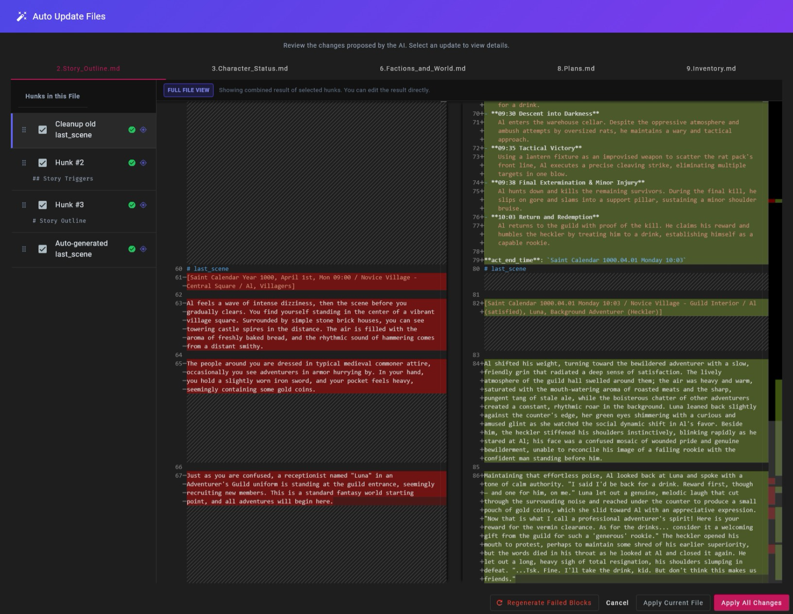

# TextRPG Engine

[繁體中文](README.zh-TW.md) | [English](README.md)

**[線上 Demo](https://hsinyu-chen.github.io/text-rpg/)**

> [!NOTE]
> 線上 Demo 未配置 GCP OAuth 憑證，**Google Drive 同步功能已停用**。其他功能（Gemini API、OpenAI 相容 endpoint、本地檔案系統、llama.cpp）均正常運作——請自備 API Key。

一個本地優先（Local-First）的 TRPG 引擎，專注於嚴謹的狀態管理與長窗口敘事。Gemini、任何 OpenAI 相容 endpoint、llama.cpp 皆為一等公民 Provider；本地 llama.cpp 路徑為功能最完整的一條（即時 PP/TG 速度指標、持久化 slot KV cache、tool-call 探測）。

> **請注意**：這是針對特定本地架構高度客製化的私人工具。僅供教學參考。不提供任何技術支援。

TextRPG 是一個**本地優先 (Local-First)**、**自帶金鑰 (Bring Your Own Key)** 的桌面/WEB 應用程式，圍繞長窗口 LLM 而設計。它不同於傳統的 AI 聊天機器人，而是將 LLM 視為一個嚴謹的「地下城主 (DM)」，透過結構化思考與邏輯判定推進劇情，並把遊戲狀態（物品、任務、劇情摘要）持久化於本地 Markdown 檔案中。本專案採用 **Local-First** 架構，結合 Tauri 與 Angular，將 LLM 作為邏輯處理核心 —— 通過 JSON Schema 強制模型執行「判定優先」的流程。

## 功能展示 (Feature Demo)





---

## 快速開始 (Getting Started)

1. **安裝與啟動**:
    *   下載專案原始碼 (請確保已拉取子模組：`git submodule update --init --recursive`)。
    *   在專案資料夾開啟終端機 (Terminal)。
    *   輸入 `npm install` 安裝所需依賴。
    *   輸入 `npm start` 啟動網頁介面。
    *   *(如果您覺得 `npm` 聽起來像是在清喉嚨，強烈建議諮詢您身邊的 AI 助手——它們對此非常有耐心！)* 🤖

2. **初始設定**:
    *   點擊介面左上角的 **Settings** (設定) 按鈕。
    *   填入您的 **Google Gemini API Key**。
    *   檢查 **Output Language** (預設為繁體中文)。

## 建議使用流程 (Recommended Workflow)

1. **冒險之書 (Adventure Books) (新功能!)**
   *   **概念**: 每一局遊戲現在都是一本獨立的「冒險之書」。
   *   **開始**: 前往 **Session** 分頁 → 點擊 **New Game** 建立新的冒險之書。**建議走 Generate 分頁** —— 用一段描述告訴 AI 您想要的世界與主角，讓 Agent 自動填寫全部 9 個世界檔案（詳見下方〈AI 世界生成器〉）。**Pre-build** 分頁目前僅內建一個非常陽春的 demo 劇本，用來快速試玩引擎可以，認真遊玩請走 Generate。

2. **遊戲循環 (Gameplay Loop)**
   *   **推演**: 與 AI 進行劇情互動與推演。
   *   **存檔**: 當一個章節結束後，使用 `<存檔>` (Save) 指令。
   *   **更新世界**: 點擊 **Auto Update** 按鈕將劇情變動寫回設定檔。

3. **備份與同步 (Backup & Sync)**
   *   **雲端同步**: 在 **Session** (冒險之書列表) 點擊 **"Sync All"**，將所有 Book 與 Collection 與目前選定的 Sync Provider 雙向同步。在 **Settings → Sync Provider** 切換 Provider:
       *   **S3-compatible** *（強烈建議）* — 貼上 endpoint / bucket / access key / secret key 即可。已用 SeaweedFS 實測；任何相容 SigV4 + path-style URL 的 S3 服務（MinIO、R2、AWS）理論上都能用。自架的話一個 `docker-compose up` 就跑起來，日常使用速度也比 Drive 快。
       *   S3 表單提供 Import / Export 按鈕，可將設定以 JSON 來回複製，跨裝置部署不必重打欄位。
       *   **Google Drive** — App Data 資料夾；需要 GCP OAuth Client ID。*只有在你真的完全不想自架任何儲存服務時才推薦這條路* — Drive App Data API 明顯比自架 S3 慢，OAuth 設定也繁瑣。詳見下方 [GCP 配置 (OAuth)](#gcp-配置-oauth) 章節。
       *   **Local Folder**（本地資料夾）— 透過 File System Access API 選一個本機資料夾。**僅 Chromium 系**（Chrome / Edge / WebView2；Firefox / Safari 上 radio 灰反白）。**刻意不支援 auto-sync** — 資料夾存取依賴 FSA 權限,而 Chrome 是否跨 reload 持久化權限取決於使用者有沒有勾「永久允許」這個 checkbox。把所有 sync 動作都鎖定為使用者點擊觸發,可以避免「勾了的人」跟「沒勾的人」之間出現 auto-sync 靜默失敗的不一致行為。*零基建跨裝置同步選項*:把選定的資料夾指到桌面端 cloud client（Dropbox / Google Drive 桌面版 / iCloud Drive / Syncthing）同步的位置。注意 — 這等於串了兩層 sync(本 App → 資料夾 → cloud client),擴散速度慢,且兩台裝置同時編輯時容易產生衝突檔（`Foo (1).json`、`.sync-conflict-*.json`)。`list()` 會自動過濾掉這類檔案,但底層 cloud client 若不會自動處理就得手動解決。
   *   **本地備份**: 也可以使用 **資料夾圖示** 將當前書籍匯出至本機目錄保存。

4. **下一章節 (Next Session / Act II+)**
   *   **建立下一章**: 當章節結束時，點擊側邊欄的 **"Create Next"** (建立下一章) 按鈕，系統會自動繼承所有記憶與數值，建立一本新的冒險之書（例如 "Act 2"）。新書會落在與來源書相同的 Collection 內。
   *   **繼續遊玩**: 開啟 **Session** 列表 -> 選擇最新的冒險之書繼續。
   *   **循環**: 遊玩 -> `<存檔>` -> **Auto Update** -> **Create Next**。

---

## 編輯與自動化 (Editing & Automation)

引擎提供多種介入手段，讓您能完全掌控劇情走向：

### 1. 修正重發 (Edit & Resend)
如果 AI 的回應不滿意，您不需要重新輸入。只需點擊**訊息上方工具列**的 **"Edit & Resend"** (筆記圖示) 按鈕，即可修改您上一輪的指令或對話，讓 AI 重新生成。

### 2. 日誌與摘要編輯 (Log & Summary Editing)
AI 產生的 **Inventory (物品欄)**、**Quest Log (任務)**、**World (世界/技術)** 與 **Summary (摘要)** 皆可手動修改。
*   點擊對話氣泡中的鉛筆圖示，即可增刪道具或修改任務狀態。
*   這些修改會即時寫入記憶體，影響 AI 下一回合的判斷。

### 3. 自動世界更新 (Automatic World Update)
當您使用 `<存檔>` (Save) 指令時，AI 不僅會儲存進度，還會嘗試**更新世界設定檔**：
*   **觸發方式**: 
    1. 在輸入框左側的選單選擇 `<存檔>`。
    2. 或直接點擊輸入框上方的 **Save** (磁碟片圖示) 按鈕。
    3. 發送訊息後，若有劇情變動，點擊訊息上方工具列的 **"Auto Update"** (魔術棒圖示) 按鈕。
*   **運作機制**: 模型會分析本章節的劇情變動，並輸出 XML 格式的差分更新 (Diff)。
*   **審核介面**: 點擊後系統會彈出 **"Auto-Update"** 視窗，顯示 AI 建議修改的檔案（如 `2.劇情綱要.md` 或 `6.勢力與世界.md`）。您可以逐條審核並套用，確保世界觀隨著劇情自動演進。

### 4. 知識庫檔案編輯 (KB File Editing)
除了對話與日誌外，您也可以直接編輯遊戲的底層知識庫 (Markdown 檔案)：
*   **進入方式**: 點擊側邊欄的 **"View Files"** (資料夾圖示) 按鈕。
*   **功能**: 開啟 **File Viewer** 視窗，左側列出所有載入的 Markdown 檔案。
*   **編輯**: 選擇檔案後，點擊右上角的 **"Edit"** 按鈕即可進入編輯模式 (Monaco Editor)。
*   **儲存**: 修改完成後點擊 **"Save"**，系統會即時寫入檔案並更新記憶體，無需重啟遊戲。
*   **大綱導航**: 編輯器左下角提供 Markdown 大綱 (Outline)，方便快速跳轉章節。

### 5. AI Agent 編輯協作 (AI Agent Edit Helper)
File Viewer 視窗內建一個 AI Agent，可代為讀取、搜尋並修改目前載入的 Markdown 檔案。
*   **進入方式**: 在 File Viewer 側邊欄切換至 **AI Agent** 分頁（機器人圖示），與 Files、Search & Replace 並列。
*   **Profile 選擇**: 從下拉選單選擇 Agent Profile，每個 Profile 帶有自己的模型、System Prompt 與工具設定。
*   **Tool Call Mode**: 提供 **Auto**、**Native**（服務商原生 function calling）、**JSON**（以 Schema 約束文字輸出）三種模式；Auto 會依當前 Profile 自動選用合適的模式。
*   **可用工具**: Agent 操作對象為當前載入於對話框中的檔案，採用 discovery-first 工作流程，常見工具包含目錄/檔案列出、檔案讀取、附帶 context lines 的 grep，以及用於定點編輯的 `searchReplace`。
*   **執行紀錄**: Console 區塊會顯示使用者輸入、模型回覆（以 Markdown 渲染）、思考過程、Tool 呼叫請求以及 Tool 執行結果。每一段思考、工具呼叫、工具結果區塊皆可獨立摺疊。
*   **Context Usage**: 即時顯示目前用量佔模型 Context Window 的比例。
*   **操作控制**: 以 Enter 或送出按鈕送出 Prompt；運行中可按停止按鈕中斷；清空按鈕可重置對話。
*   **變更持久化**: Agent 進行的編輯會走與手動編輯相同的寫入路徑，因此變更會反映在編輯器上並標記為未儲存，直到您按下 **Save Changes** 確認。

---

## 遊戲指令使用指南 (Game Command Guide)

### 行動 (Action) : 推進劇情的主要方式
**格式**: `([心境]動作)台詞或內心獨白`  
*範例*: `([緊張]抱著女主角，說)你還好嗎??`  
> [!TIP]
> 任何行動皆為「嘗試」，AI 會根據能力、環境與隨機事件判定成敗。
>
> **降低被擋機率的技巧**：強烈建議使用**第三人稱**完整句描述行動（例如：「里昂擁抱了瑪莉」），盡量避免使用省略主詞（「擁抱了瑪莉」）或第一人稱（「我擁抱了瑪莉」）。明確的主詞能顯著降低 AI 誤判並減少觸發 API 安全性阻擋的機率。

### 快轉 (Fast Forward) : 跳過平淡時段
**格式**: `目標時間或地點`  
*範例*: `三天後` 或 `回到旅館`  
> [!NOTE]
> 若快轉期間發生特別事件（如 NPC 拜訪），系統會自動停止快轉並進入對話。

### 系統 (System) : 劇情修正或提問
**格式**: `命令內容`  
*範例*: `這個 NPC 的反應不符合他的設定，他應該更謹慎`  
> [!IMPORTANT]
> 用於 OOC 對話或對劇情提出質疑。AI 會直接修正劇情或提供邏輯解釋。

### 存檔 (Save) : 分析並同步狀態
**格式**: `存檔範圍或修正要求`  
*範例*: `本輪劇情存檔`  
> [!NOTE]
> AI 會總結本章節並輸出 XML 格式的檔案更新，確保世界狀態被正確記錄。

### 繼續 (Continue) : 自然推進
**動作**: 直接點擊發送或輸入 `繼續`  
> [!TIP]
> 用於等待 NPC 反應或觀察環境變化。

---

## 🏗️ 技術架構 (Technical Architecture)

### 1. 雙階段推理流程 (Two-Stage Reasoning)
為了避免 LLM 常見的邏輯不一致與幻覺問題，每一回合的生成被嚴格定義為兩個階段：
*   **Analysis Phase (Hidden)**: 強制模型輸出 `analysis` 欄位，進行意圖識別、規則檢核與環境狀態檢查。此階段的輸出不會顯示給終端用戶。
*   **Generation Phase (Visible)**: 基於 Analysis 的結果生成 `story`，並同時更新 JSON 格式的 `inventory_log` (物品)、`quest_log` (任務) 與 `world_log` (世界事件、地標物產、裝備科技與魔法開發)。

### 2. 混合式上下文管理 (Hybrid Context Management)
針對 Gemini 3 的長窗口特性，引擎實作了多種 Context 策略：
*   **Smart Context**: 動態組裝「劇情大綱 (Markdown)」+「完整對話歷史 (Chat History)」。
*   **Context Caching Integration**: 整合 Gemini API 的 Context Caching 功能。當 Token 數超過閾值（如 32k），自動建立服務端 Cache，將重複的 System Prompt 與歷史訊息快取，顯著降低 Time-to-First-Token (TTFT) 與 API 成本。

### 3. 本地優先儲存 + 雲端同步 (Local-first Storage with Cloud Sync)
Books、Collections、Settings 都存在每台裝置的 IndexedDB 中；雲端 backend 負責跨裝置同步，但本地 store 才是權威來源 — 離線時仍可正常使用。
*   **Source of Truth**: IndexedDB。讀取走本地、寫入先寫本地再透過 sync 層擴散。
*   **同步策略**: 以裝置時鐘的 `lastActiveAt` (books) / `updatedAt` (collections) 做 newer-wins，時間戳記在雲端物件的 metadata。跨裝置刪除靠 per-id tombstones（帶自己的 `deletedAt`）傳遞，長時間離線的裝置回來後仍能收到刪除訊息。
*   **快照與還原 (Snapshots & Restore)**: `Force Push` / `Force Pull` 在覆蓋前會自動建一份時間點快照（push 拍雲端，pull 拍本機）。使用者也可手動建快照，restore 前會自動建一份 `preRestore` 救援點。所有快照在 *Advanced Sync Tools* dialog 中列表，可 restore / delete / 編輯 note；auto-trigger 的快照有保留上限，手動快照永久保留。
*   **File System Access**: 透過瀏覽器 File System Access API 提供可選的磁碟匯入 / 匯出 — 用於與 VS Code / Obsidian 等外部工具互通，不是主儲存層。

## 功能特性 (Feature Specifications)

| 特性模組 | 技術實作細節 |
| :--- | :--- |
| **冒險之書 & Collection** | Books 透過 **Collection** 分組管理。`New Game` 會以 `${玩家名} · ${場景名}` 規則自動建立 Collection;`Create Next` 與 `Create Scene` 繼承來源書的 Collection。Books 可透過 dialog 在 Collection 之間搬移,active book 所在的 Collection 會 highlight。保留一個 `root` Collection 收容未分類或舊版資料(在 Collection 概念引入前已存在的書會自動遷移到此)。 |
| **同步後端 (Sync Backends)** | 可插拔 Provider 註冊機制 — Books、Collections、Settings 全部走同一個 `SyncBackend` 介面。內建三個 Backend:**Google Drive**(App Data folder)、**S3-compatible**(`@aws-sdk/client-s3`,lazy-loaded,使用 Drive 時 SDK 不進 initial bundle),以及 **Local Folder**(File System Access API,僅 Chromium 系 — `isAvailable` capability gate 在沒有 `showDirectoryPicker` 的瀏覽器上自動把 radio 灰反白)。雙向同步以 `lastActiveAt` / `updatedAt` 做 newer-wins,搭配跨裝置 tombstones 傳遞刪除。 |
| **快照與還原 (Snapshots & Restore)** | `Force Push` / `Force Pull` / Restore 在執行前會自動建立時間點備份(push 拍雲端、pull 拍本機、preRestore 拍雲端),使用者也可手動建快照。*Advanced Sync Tools* dialog 列出所有快照並提供 restore / delete / 編輯 note 等操作;auto-trigger 的快照會自動 retention,手動快照永久保留。Restore 期間本機會 quiesce auto-sync,並提示使用者其他裝置先暫停同步。 |
| **狀態追蹤** | 利用 Gemini 的 JSON Mode 輸出結構化資料，自動解析並更新前端狀態 (Signals)。 |
| **World Log** | 新增 `world_log` 追蹤欄位，專門記錄世界事件、勢力動向與科技魔法發展，實現自動化的世界觀演進。 |
| **Currency** | 內建即時匯率轉換 (TWD, USD, JPY, KRW...)，可自訂顯示幣別，精確掌控 Token 消耗成本。 |
| **Prompt Injection** | 支援動態注入 System Instructions，允許在 Runtime 修改 `<Action>`, `<System>`, `<Save>` 三種模式的底層邏輯。 |
| **Token Cost Tracking** | 內建 Token 計算器與匯率轉換模組，即時監控 Input/Output/Cache 消耗並預估費用。 |
| **UI/UX** | 基於 Angular 21 (Zoneless/Signals) 與 Angular Material 3，提供現代化的響應式介面。 |
---

## LLM 服務商選項 (LLM Provider Options)

TextRPG 透過 Provider 介面抽象化 LLM 後端。目前內建三種選擇：

### Gemini（雲端，預設）
最容易上手，可直接使用 Gemini 3 系列的長窗口能力，並透過 **Context Caching**（伺服器端內容快取，TTL 計費）大幅降低長遊玩的成本。

### OpenAI 相容（雲端或自架）
一個 Provider 走 **OpenAI Chat Completions API**，可同時指向：
*   **api.openai.com**（GPT-4o、o1、o3-mini 等）—— 內建模型清單與 context size，價格欄位刻意留空讓使用者自行填寫（OpenAI 費率會變）。
*   **聚合服務**如 OpenRouter、Together —— 同樣的協定，自行輸入模型 id 與費率。
*   **自架的 OpenAI 相容伺服器** —— vLLM、TGI、Ollama、llama.cpp 自帶的 OpenAI endpoint、LM Studio 等。任意輸入模型 id 都會以 `Custom: <id>` 形式列入並走同一條程式碼路徑。
    *   ⚠️ **若您的後端是 llama.cpp，建議改用下方專屬的 llama.cpp Provider。** 只有專屬 Provider 才會顯示 PP（prompt processing）tokens/sec、生成 tokens/sec、總耗時等進階速度指標，以及 Slot Save/Restore 持久化 KV cache —— 這些功能透過 OpenAI 相容 endpoint 都拿不到。

設定面板實際提供以下控件（以 [angular-ui-openai/src/index.ts](lib/hcs-llm-monorepo/packages/angular-ui-openai/src/index.ts) 為準）：
*   **Base URL / API Key / Model ID** —— 指向任何 OpenAI 相容 endpoint。Model ID 為自由輸入，若不在預設清單會以 `Custom: <id>` 列入。
*   **Preset Pricing** 下拉 —— 內建 GPT-4 / GPT-5 / o1 / o3 / o4 等模型的 input / cached / output（每 1M）三欄價格 preset，選擇後自動填入，也可手動覆寫。
*   **Sampling** —— Temperature、Max Tokens、Frequency Penalty、Presence Penalty。
*   **Tool Calling → Native Tool Calls** —— Auto / Yes / No 三態。Auto 預設為 Yes；若您的端點 / 模型 tool call 實作不完整可釘成 No，引擎會 fallback 到 JSON-mode tool emulation。
*   **Extended Config (OpenRouter / O1 / O3) → Use Chat Template Kwargs** —— 勾選後會把額外 kwargs 透傳給支援模板的伺服器（vLLM / OpenRouter 等）。打勾後會展開兩個子控件：
    *   **Enable Thinking** —— 對開放思考通道的模型啟用 reasoning 顯示。
    *   **Reasoning Effort** —— Low / Medium / High（僅在 Enable Thinking 勾選時出現）。

什麼情況選這個 Provider：想用**雲端品質但不走 Google**、想在 OpenRouter / Together 測試模型再決定、或您本地的 stack 本來就會講 OpenAI 方言（vLLM、Ollama），不想另外起一支 llama.cpp 服務時。

### llama.cpp（本地，自架）
適合想要**完全離線**運行自有 GGUF 模型的玩家（需搭配 [llama.cpp server](https://github.com/ggerganov/llama.cpp)）。這條路徑以模型原生品質換取隱私、零經常性成本以及可預測的延遲。主要優勢：

> [!TIP]
> **使用本地模型時，建議切換到「本地版」prompt profile。** 點擊輸入列上方的 **⚙ Config 按鈕**開啟 Dynamic Prompt Settings 對話框，在側欄頂端的 **Prompt Profile** 切換器選擇 **本地版（Local）**。本地版是針對小模型常見失敗模式特化的提示集，並非單純的精簡版：
> - **更壓縮的指令措辭**——把雲端版的長句重寫成短列表，降低小模型在長 prompt 下的指令遺漏率。
> - **強化的場景分析要求**——加入「全場景反應描寫」段落，要求逐一處理在場 NPC 與環境物件，並透過「動作 / 表情·眼神 / 台詞或內心獨白」三層推演避免 NPC 變成沉默的背景板。
> - **NPC 台詞原文強制**——禁止以「咒罵著…」「怒斥主角放人」等動作化轉述帶過 NPC 發聲，必須在正文以引號寫出實際台詞（僅在主角物理上聽不見時可豁免）。這是針對小模型偷懶傾向的硬性約束。
> - **`使用者角色` vs NPC 範圍鐵則**——反覆標註原子動作拆解、禁止邏輯補完等限制**只**適用於使用者角色；NPC 必須完整、自主地演出多步驟行為，避免小模型誤把限制套到 NPC 身上而壓抑反應。
> 
> 雲端版（預設）保留完整的 jailbreak 提示與較長的散文式說明，較適合 Gemini / OpenAI 相容雲端 endpoint，這些模型對長指令的吸收能力比較強，也更需要明確的越獄段落來解開內建安全對齊。

*   **零 API 成本、資料不出機器** — 整個劇情、知識庫與對話歷史皆留在本機。對於長時間、尺度較重的劇本特別友善，不受雲端審核或帳單困擾。
*   **Prefix KV Cache 重用** — 重複的前綴 token 會被重用（透過 `cache_prompt`），後續回合的首字元響應時間 (TTFT) 大幅下降。
*   **Slot Save/Restore（持久化 Prompt Cache）** — 引擎會在一次真正的生成「之後」才把 llama.cpp 的 slot 狀態快照到硬碟的 `.bin` 檔，確保存起來的 KV 跟下次恢復時要送的 token 序列完全一致。當你重啟伺服器或重新打開冒險之書時，系統會直接 **restore** 這份 KV，而不是重新跑完整個 PP（prefill），**完全跳過最耗時的 prompt processing**。檔名以冒險之書 ID 為 key（一本書一個檔），KB / system / model 變動時會自動覆蓋，不會留下孤兒檔。
    *   在 **Settings → llama.cpp Provider → 「Persist Slot to Disk」** 啟用。
    *   啟動 llama.cpp 時需加上 `--slot-save-path <dir>`，例如：
        ```bash
        ./llama-server -m <model.gguf> --slot-save-path ./kv_cache --host 0.0.0.0
        ```
    *   當 KB 被修改時，下一次送出前會先把 slot 清空（erase），讓生成從乾淨的 KV 重建；生成結束後再把新的 KV 存下來，覆蓋掉過時的 `.bin`。
*   **即時速度指標** — 每回合的 prompt/completion tokens-per-second 以及總耗時都會顯示在側邊欄，方便調整硬體與量化設定。
*   **思考/推理支援** — 對於提供 `reasoning_content` 通道的模型（如 Qwen3、GLM 4.5 等），會正確處理 `reasoning_budget` 與思考內容。
*   **結構化輸出** — JSON Schema 強制與 Gemini 行為一致，「Analysis → Generation」雙階段流程完整保留。

> [!NOTE]
> **快取機制與 Gemini 不同。** Gemini 的快取是把內容存在伺服器端（以 cache name 引用，請求時不必重送 KB）。llama.cpp 則是以 **prefix token 匹配** 來命中 KV cache，所以 KB 仍然會被放進 prompt，存下來的 `.bin` 只是避免重算那段前綴的 KV。引擎透過 `cacheBakesContent` capability flag 自動處理這個差異。

#### 推薦模型與參考組態

針對 TRPG 這類長上下文敘事遊玩，**dense 架構、≥30B** 在指令遵循與世界觀一致性上明顯優於同等級的 MoE —— 即使 MoE 有空間跑更高精度也是如此。實測下 `gemma-4-26b-a4b`（MoE）在 Strix Halo 128 GB 上以 **Q8** 全精度跑，效果仍落後 `gemma-4-31b-it` 在 **IQ3_M** 量化下的表現。所以 VRAM 該花在 dense 模型本身，不該花在 MoE 的更高量化。最低建議組合為：

*   **模型**：`gemma-4-31b-it`（dense, instruction-tuned）。
*   **變體**：請選用**反審查（uncensored）版本** —— Gemma 原版的安全對齊在尺度較重的劇情中過於積極，常會於場景中途拒絕或自我消音。社群合併版本如 [`mradermacher/gemma-4-31b-it-heretic-ara-i1-GGUF`](https://huggingface.co/mradermacher/gemma-4-31b-it-heretic-ara-i1-GGUF) 在保留 Gemma 敘事品質的同時移除了這類拒絕行為。

##### 參考啟動指令 —— RTX 4090 24 GB

下列組態以 IQ3_M 量化權重搭配 q8_0 KV cache 量化，可在 24 GB VRAM 內塞下 31B dense 模型 **+ 140 K context**：

```bash
llama-server \
  -m gemma-4-31b-it-heretic-ara.i1-IQ3_M.gguf \
  --flash-attn 1 \
  --temp 1 --top-k 64 --top-p 0.95 \
  -c 143360 \
  -ctk q8_0 -ctv q8_0 \
  --n-gpu-layers 99 \
  -np 1 \
  --slot-save-path cache
```

逐項說明：

| 參數 | 用途 |
| :--- | :--- |
| `-m gemma-4-31b-it-heretic-ara.i1-IQ3_M.gguf` | 對 24 GB 卡跑 31B dense 而言，IQ3_M 是甜蜜點 —— 夠小可以保留長 KV 空間，又位於 3 bpw 以上避免明顯的品質懸崖。 |
| `--flash-attn 1` | 啟用 FlashAttention；下方 q8_0 KV cache 必須搭配它才有效益。 |
| `--temp 1 --top-k 64 --top-p 0.95` | Gemma 官方推薦的 sampling 預設值；無特殊理由不要動。 |
| `-c 143360` | 140 K 上下文窗口，貼近 Gemma 4 的有效長窗口範圍，給 KB + 章節歷史在跨多幕戰役下保留充足空間，避免被截斷。 |
| `-ctk q8_0 -ctv q8_0` | 將 KV cache 量化為 8-bit，相對 fp16 大致省一半 VRAM 且品質損失可忽略 —— 這正是讓 140 K context 與模型權重共存於 24 GB 的關鍵。 |
| `--n-gpu-layers 99` | 全部層 offload 到 GPU（任何 ≥ 層數的值皆可）。 |
| `-np 1` | 單一 slot。引擎會把每本冒險之書釘在同一個 slot 上以維持 prefix cache 穩定；單人遊玩開更多 slot 只會白白切走 VRAM。 |
| `--slot-save-path cache` | 持久化 KV `.bin` 的存放目錄。前面提到的 **「Persist Slot to Disk」** 功能必須要有這個參數。 |

> [!TIP]
> **IQ3_M 是我們實際驗證過的最低量化等級。** IQ2 / IQ1 在 31 B dense 上未經測試 —— 此尺寸下繼續往下推量化已知會踩到品質懸崖。若 24 GB 顯得吃緊，請先降 `-c`（例如到 64 K）再考慮降量化；若仍撐不住 IQ3_M，建議改用**較小的 dense 模型**（如 12 B 跑 Q4–Q5），而非把 31 B 進一步壓縮。

兩種 Provider 皆可在 **Settings** 中設定並即時切換，每本冒險之書的上下文都會被保留。

---

## 提示詞調教指南

為了確保模型運作順暢，請遵循以下標準作業程序：

### 1. 塗抹聖油
在 System Prompt 中必須添加大量的 "Do not" 與 "Must follow" 指令。無須探究其中哪一句真正發揮效用，為了保險起見，應將其視為聖油全部塗抹，以確保邏輯迴路的純淨。

### 2. 安撫機魂
當遭遇模型降智時，禁止嘗試查詢不存在的 Log。正確的處置方式為立即關閉 Session 重啟，或轉換為更溫柔的語氣重新提問。這是安撫機魂情緒的必要儀式，而非迷信。

### 3. 異端審判
一旦偵測到模型產生幻覺，應視同亞空間惡魔入侵。操作者須立即按下 Stop 終止程序，並透過劇烈調整 Temperature 參數，試圖重建蓋勒力場以抵禦污染。

### 4. 遵循 STC
網路上流傳的「超級 Prompt」即為神聖的 STC 碎片。操作者應直接複製並執行，無須理解背後原理。任何對原始文本的微小改動，皆將被視為對標準建造模板的褻瀆。

---

### 祝福

在此以二進制的聖歌為你的開發之路祈福：

`01010000 01110010 01100001 01101001 01110011 01100101`

**願歐姆彌賽亞今日賜予你低延遲的響應，願你的 Context Window 永遠純淨，願所有的 Token 都免於亞空間的腐蝕。**

---

## 開發 (Development)

### 技術堆疊
*   **Frontend**: Angular 21 (Standalone, Signals)
*   **Backend/Shell**: Tauri 2 (Rust)
*   **Styling**: SCSS, Angular Material 3
*   **State**: RxJS, Angular Signals
*   **SDK**: Google GenAI SDK (`@google/genai`)

### 環境建置

```bash
# 0. 複製專案與子模組
# 本專案包含子模組。複製時請務必加上 --recursive 參數：
# git clone --recursive <repository-url>
# 或者如果您已經複製了專案：
git submodule update --init --recursive

# 1. 安裝依賴
npm install

# 2. 啟動 Web 開發模式 (Hot Reload)
npm run start

# 3. 啟動桌面應用開發模式 (Tauri)
npm run desktop
```

### 配置說明
首次啟動需在設定面板 (Settings) 配置：
*   **API Key**: Google Gemini API Key.
*   **Model ID**: 支援 `gemini-3-pro-preview`, `gemini-3-flash-preview` 等模型。
*   **Exchange Rate**: 用於即時成本估算的匯率。
*   **Output Language**: 選擇 AI 輸出語言（繁體中文、英文）。

> [!TIP]
> **成本優化建議**：使用 Gemini 模型時，強烈建議在 `Settings` -> `Gemini Provider` 中啟用 **Explicit Context Caching** (顯式上下文快取)，以大幅降低長窗口遊玩的 Token 費用。
>
> **重要提醒**：結束遊玩時，請務必點擊側邊欄的 **"Clear Current Cache"** (清除快取/掃把圖示) 按鈕，以停止快取租賃計費！

---

## 部署指南 (Deployment)

本專案支援三種主要的部署方式：

### 1. Web 靜態部署 (Static Web App)
適用於 Nginx, Apache 或靜態託管服務 (Vercel, GitHub Pages)。

```bash
# 建立建置檔
npm run build
```
*   **輸出位置**: `dist/text-rpg/browser`
*   **部署**: 將該目錄下的所有檔案上傳至您的 Web 伺服器根目錄。
*   **注意**: 需配置伺服器 Rewrite 規則以支援 Angular 路由 (指向 index.html)。

### 2. Docker 部署 (Container)
適用於 NAS (Synology), Linux Server 或雲端容器服務。

```bash
# 建置 Docker Image
docker build -t text-rpg .

# 啟動 Container (Mapping Port 8080 -> 80)
docker run -d -p 8080:80 --name text-rpg-instance text-rpg
```
*   內建 Nginx 設定已優化 Angular 路由支援。

### 3.本機應用程式部屬 (Tauri Desktop)
適用於 Windows, macOS, Linux 本地執行，擁有最佳效能與檔案存取權限。

```bash
# 建置原有安裝檔
npm run build:desktop
```
*   **Windows**: `src-tauri/target/release/bundle/msi/`
*   **macOS**: `src-tauri/target/release/bundle/dmg/`
*   **Linux**: `src-tauri/target/release/bundle/deb/`

### GCP 配置 (OAuth)

> **不建議使用此選項，除非你真的不想架 S3。** Google OAuth 的設定流程繁瑣（需要 GCP 專案、OAuth consent screen、發布審核等），而且 Drive App Data API **明顯比自架 S3 endpoint 慢** —— 每次 list/read/write 都要走 Google 的 auth + quota stack，相較於指到 LAN 上的 MinIO 同步起來會頓頓的。S3-compatible backend（SeaweedFS / MinIO / R2）通常一個 docker-compose 就能跑起來，維護成本低、速度也快得多。建議只有在完全不想自架任何儲存服務時才走這條路。

若要啟用 Google Drive 同步，您需要配置自己的 GCP OAuth 憑證：

1.  **建立 GCP 專案**：前往 [Google Cloud Console](https://console.cloud.google.com/)。
2.  **配置 OAuth 同意畫面**：設定 OAuth 同意畫面。
3.  **建立 OAuth 2.0 用戶端 ID** — 視你跑的版本：
    *   **Web 版**：建立 **「網頁應用程式」** 類型 client ID，並把你部署的 origin（例如 `http://localhost:4200`）加入 *Authorized JavaScript origins*（App 內走的是 GIS popup flow，認 origin 不認 redirect URI，所以「Authorized redirect URIs」可以留空）。
    *   **Tauri 桌面版**：建立 **「桌面應用程式」** (Desktop app) 類型 client ID。**Tauri PKCE flow 不能用網頁應用程式類型** — 必須用 Desktop 類型搭配 client secret 才能 token exchange。
4.  **提供憑證**：
    *   **Web** — 擇一即可：
        *   *烘進 build*（不想用 runtime UI 的自架者）：在 `src/environments/environment.ts` 與 `environment.development.ts` 填入 `gcpOauthAppId`。
        *   *執行時貼入*（不需重新 build）：`gcpOauthAppId` 留空，到 **Settings → Sync → Google Drive** 貼 Client ID。只有 environment 留空時才出現輸入欄位。不會建立的話可以問你的 AI 朋友：「how to create a Google OAuth Web-application client id with the `drive.appdata` scope」。
    *   **Tauri** — env-only（必須 rebuild）：本專案沒有提供官方桌面版 release，使用者一律從 source build，因此憑證必須在 build 前烘進去 — 在 environment 檔填好 `gcpOauthAppId_Tauri` 與 `gcpOauthClientSecret_Tauri` 後再執行 `npm run build:desktop`。

### 語系切換 (Language Switching)

TextRPG 支援**動態語系切換**，無需重新啟動應用程式：

#### 1. 切換 AI 輸出語言
*   **位置**: Settings → Game Settings → Output Language
*   **支援語言**: 繁體中文、英文
*   **影響範圍**:
    *   AI 生成的故事內容語言
    *   `summary`、`inventory_log`、`quest_log`、`world_log` 等結構化輸出
    *   系統文件名稱（如 `2.Story_Outline.md` vs `2.劇情綱要.md`）
    *   輸入提示格式（如 `([Mood]Action)Dialogue` vs `([心境]動作)台詞`）
    *   AI 世界生成器：Quick Preset、身份清單、空白世界模板資料夾（`blank_world_zh` / `blank_world_en`）以及世界生成 Prompt 模板（`create_world_prompt_zh.md` / `create_world_prompt_en.md`）

#### 2. UI 介面語言
*   **目前狀態**: 多數 UI 文字（意圖標籤、劇本選單、Pre-build 分頁、Settings 等）會透過自定義 locale 系統（`src/app/core/constants/locales/`）隨 Output Language 即時切換。
*   **已知例外**: New Game 對話框中的 **Generate** 分頁，介面文字（如 *Quick Preset*、*Genre*、*Tone*、*World Setting*、*Identity / Role*、*Generate World* 等 label / placeholder）目前為硬編碼英文，不會切換。但其產生的 *內容*（preset、身份、最終生成的世界檔案）仍會跟隨 Output Language —— 只有表單外殼是英文。

#### 3. 混合語言場景（不建議）
> [!WARNING]
> 雖然系統技術上支援混合語言使用（例如：英文 UI + 繁體中文劇本），但**強烈不建議**這樣做。

**問題**：
*   **敘事不一致**: AI 輸出語言與劇本內容語言不同會導致故事連貫性問題
*   **角色名稱混亂**: 角色名稱可能在不同語言間轉換，造成混淆
*   **世界觀衝突**: 地名、物品名稱等在不同語言版本間可能不一致

**建議**：
*   **始終使用相同語言**: 確保 Output Language 設定與選擇的劇本語言一致
*   **技術支援**: 系統會自動偵測劇本文件語言並適配 section headers 和 adult declaration，但這僅用於技術相容性，不保證敘事品質

#### 4. 切換注意事項
*   **現有遊戲**: 切換語言後，新的 AI 回應會使用新語言，但歷史訊息保持原語言
*   **文件命名**: 建議在開始新遊戲前先設定好語言，避免文件名稱不一致
*   **劇本相容性**: 確保選擇的劇本有對應語言版本（參見下方本地化指南）

---

## 本地化指南 (Localization Guide)

TextRPG 採用**自定義 locale 系統**，所有可本地化的內容皆由 [src/app/core/constants/locales/locale.interface.ts](src/app/core/constants/locales/locale.interface.ts) 中的 `AppLocale` 介面所定義；系統內建兩種語言，新增語言主要是寫一支 `.ts` 檔加上翻譯劇本內容。

### 已內建支援的語言
*   **繁體中文** (`zh-TW`) — 註冊鍵為 `'Traditional Chinese'`，同時作為 `'default'` fallback
*   **英文** (`en-US`) — 註冊鍵為 `'English'`

語言解析由 [src/app/core/constants/locales/index.ts](src/app/core/constants/locales/index.ts) 提供：
*   `getLocale(lang)` — 回傳對應 `AppLocale`，找不到時依 `id` 比對，再不行則回傳 `'default'`。
*   `getLangFolder(lang)` — 回傳該 locale 的 `folder` 欄位，用來解析 `public/assets/system_files/<folder>/` 下以語言分桶的素材。
*   `getLanguagesList()` — 餵給 Settings 的 Output Language 下拉選單。

### Locale 物件涵蓋（自動本地化）

切換 Output Language 時，下列項目會直接讀取目前的 `AppLocale` 並切換：

| 介面 | `AppLocale` 上對應欄位 |
| :--- | :--- |
| AI 回應 JSON Schema 的描述 | `responseSchema` |
| 系統提示詞前綴的成人內容聲明 | `adultDeclaration` |
| 寫入歷史紀錄的章節標題 | `actHeader` |
| 角色檔（`BASIC_SETTINGS` → `1.Base_Settings.md` / `1.基礎設定.md` 等）對應的實際檔名 | `coreFilenames` |
| 強制模型以目標語言輸出的語言規則注入 | `promptHoles.LANGUAGE_RULE` |
| Markdown 區段標題（`START_SCENE`、`INPUT_FORMAT`） | `sectionHeaders` |
| 意圖選單（Action / Fast Forward / System / Save / Continue）的標籤、XML tag、描述、輸入 placeholder | `intentLabels`、`intentTags`、`intentDescriptions`、`inputPlaceholders` |
| 所有 UI 字串：對話框標題、按鈕、錯誤、alignment 九宮格、批次搜尋取代、過濾器、再生流程、Calibrate 模式等 | `uiStrings` |

過大不適合放在字串內的系統提示詞素材，則放於 `public/assets/system_files/<folder>/` 下，透過 `getLangFolder()` 載入。

### 仍需手動翻譯的部分

#### 1. 劇本內容 (Scenario Content)
劇本 `.md` 檔不屬於 locale 物件 —— 每個劇本各自帶語言版本，並在 [public/assets/system_files/scenario/scenarios.json](public/assets/system_files/scenario/scenarios.json) 註冊；其中的 `lang` 欄位（`zh-TW`、`en-US`...）正是 New Game 對話框用來篩選顯示的依據。

要為現有劇本新增語言版本：
1.  將劇本資料夾（如 `public/assets/system_files/scenario/fareast/`）複製到同層的新資料夾。
2.  翻譯其中的 `.md` 檔，且檔名必須對應到某個現有 locale 的 `coreFilenames` —— 例如 `en-US` 應使用 `1.Base_Settings.md`、`2.Story_Outline.md`、`3.Character_Status.md`、`4.Assets.md`、`5.Tech_Equipment.md`、`6.Factions_and_World.md`、`7.Magic.md`、`8.Plans.md`、`9.Inventory.md`。
3.  在 `scenarios.json` 加入一筆新項目，包含唯一的 `id`、對應的 `lang`、`baseDir`，以及把每個角色檔（`BASIC_SETTINGS`、...）映射到實際檔名的 `files` 區塊。
4.  保留 `Character_Status.md` 內的 `<!uc_*>` placeholder tag —— New Game 對話框會解析它們以預填主角表單（見 [new-game-dialog.component.ts](src/app/features/sidebar/components/new-game-dialog/new-game-dialog.component.ts) 的 `loadDefaultValues`）。

#### 2. AI 世界生成器素材
Generate 分頁會吃以下三種**獨立於 locale 物件**的語言分桶素材：
*   **空白世界模板**：`public/assets/system_files/scenario/blank_world_zh/` 與 `blank_world_en/` —— 各自包含 9 個帶 `{{PROTAGONIST_*}}` 佔位符的 `.md` 起始檔。
*   **世界生成 Prompt**：`public/assets/system_files/create_world_prompt_zh.md` 與 `create_world_prompt_en.md` —— Agent 的 system prompt，含 `{{GENRE}}`、`{{TONE}}`、`{{SETTING}}`、`{{PROTAGONIST_*}}`、`{{NPC_PREFERENCES}}`、`{{SPECIAL_REQUESTS}}` 等替換點。
*   **Quick Preset 與 Identity 選項**：[src/app/core/constants/world-preset.ts](src/app/core/constants/world-preset.ts) 中的 `WORLD_PRESETS.zh` / `WORLD_PRESETS.en` 陣列。

目前生成器以 `isZhLang()` 二分（zh-TW vs 其他全部 fallback 到 `en`），新增第三語言時要稍微改一下 [new-game-dialog.component.ts](src/app/features/sidebar/components/new-game-dialog/new-game-dialog.component.ts) —— 將 `submitCreateWorld()` 內的 `isZh` 三元判斷與 `langPresets()` dispatch 改為 locale id 多分支。

#### 3. Generate 分頁的表單 label
如前面〈語系切換〉所提，Generate 分頁的 label 與 placeholder（`Quick Preset`、`Genre`、`Tone`、`World Setting`、`Identity / Role`、`Generate World` 等）目前在 [new-game-dialog.component.html](src/app/features/sidebar/components/new-game-dialog/new-game-dialog.component.html) 中為硬編碼英文。將其遷入 `uiStrings` 是已知待辦項 —— 若您的翻譯也需要連表單外殼一起本地化，請順手改這支模板。

### 添加新語言（以日文為例）

1.  **建立 locale 檔**：新增 `src/app/core/constants/locales/ja.ts`，匯出實作 `AppLocale` 全部欄位（見上表）的 `JA_JP_LOCALE`，挑一個穩定的 `id`（如 `ja-JP`）與 `folder`（如 `ja`）。
2.  **註冊**：在 [src/app/core/constants/locales/index.ts](src/app/core/constants/locales/index.ts) 的 `LOCALES` map 中加入該 locale，使用一個易讀的 key（例如 `'Japanese'`）。新增後即會透過 `getLanguagesList()` 自動出現在 Settings → Output Language 下拉中。
3.  **提供系統提示詞素材**：在 `public/assets/system_files/<folder>/` 建立對應目錄，仿照 `en/`、`zh-tw/`。
4.  **提供劇本內容**：至少翻一個現有劇本（見上面〈劇本內容〉），或改用 AI 世界生成器 —— 若選後者請順便做下面第 5 步。
5.  **（選用）擴充 AI 世界生成器**：在 `world-preset.ts` 加上 `WORLD_PRESETS.ja`，提供 `blank_world_ja/` 與 `create_world_prompt_ja.md`，並把 `new-game-dialog.component.ts` 中的 `isZhLang()` 二分改為以 locale id 區分的多分支。

---

## 建立新遊戲與匯出模版 (New Game & Export)

本引擎內建「劇本模版生成」功能，您不需要手動建立檔案：

1.  點擊左側邊欄的 **"Session"** 標籤頁。
2.  點擊 **"New Game"** 按鈕。
3.  選擇劇本 (Scenario) 並填寫主角設定 (或是使用預設值)。
4.  點擊 **"Start Game"**，引擎會自動在記憶體中生成所有所需的 Markdown 檔案。
5.  **匯出模版**: 新書載入後，切到側邊欄 **Files** 分頁，捲到檔案列表下方的 **Local File System** 區塊，點擊 **資料夾圖示** 選擇一個空資料夾，接著點擊 **"Sync"**。
6.  系統會將所有自動生成的設定檔寫入您的資料夾，您隨後即可使用 VS Code 進行編輯。

### AI 世界生成器（Generate 分頁）

New Game 對話框的 **Generate** 分頁可讓您不依賴預設劇本，透過 AI Agent 從零建構一個全新的世界：

1.  點擊 **New Game** → 切換至 **Generate** 分頁。
2.  可選擇 **Quick Preset**（如劍與魔法、武俠江湖、賽博龐克等）— 它會自動填入類型／基調／世界設定，並為主角帶入一個預設 **Identity / Role（身份）**，連同其背景、陣營、興趣、外貌、NPC 提示與特殊要求一併套用。Preset 清單、身份與預填文字會跟隨目前 Output Language 自動切換（`WORLD_PRESETS.zh` / `WORLD_PRESETS.en`）。
3.  填寫 **Genre（類型）**、**Tone（基調）** 與 **World Setting（世界設定）**。
4.  填寫主角資訊：
    *   **Name（姓名）**、**Gender（性別，可留空）**、**Age（年齡，可留空）**。
    *   **Identity / Role（身份）** — 從 preset 清單中挑選，或點選 **✏ Custom...** 自行輸入。從下拉切換身份時，會重新套用該 preset 的背景、陣營、興趣、外貌、NPC 提示與特殊要求。
    *   **Alignment（陣營）** — 從九宮格中挑選。
    *   **Background（背景）**、**Interests / Hobbies（興趣）**、**Appearance（外貌）**。
5.  選填欄位：
    *   **NPC Preferences** — 描述您希望出現的 2–3 位核心配角（如可發展戀情的夥伴、宿敵、神秘導師等）。
    *   **Special Requests** — 額外的主題或限制（如「不要金手指」、「加入戀愛支線」等）。
6.  選擇 **AI Profile for Generation** — 由哪個 LLM Profile（服務商／模型／System Prompt）驅動世界生成 Agent；預設為您目前的 active profile。
7.  點擊 **Generate World** 啟動 Agent。引擎會載入空白世界模板（`assets/system_files/scenario/blank_world_zh` 或 `blank_world_en`），把主角資料代入 `3.人物狀態.md` / `3.Character_Status.md`，並在 **Create World** 模式下開啟 File Viewer，讓 Agent 補完其餘 8 個世界檔案。內建的完成度驗證器會拒絕仍含有 `（種族）`、`（起始位置）`、`(Race)`、`To be filled in by the world generator` 等佔位符的提交，並要求 Agent 重試直到所有欄位填滿。
8.  審閱並調整生成內容後，點擊 File Viewer 底部的 **Start Game** 開始遊戲。
 
 ---
 
 ## 授權協議 (License)
 
 本專案採用 **GNU Affero General Public License v3.0 (AGPL-3.0)** 進行授權 - 詳見 [LICENSE](LICENSE) 檔案。
